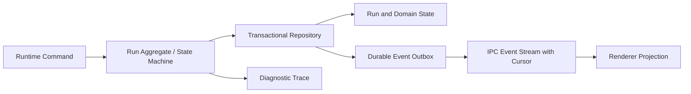

# Ariadne Agent 成熟度差距与改进路线

> 文档状态：基线审计 v1
> 审计日期：2026-07-22
> 审计范围：当前 Ariadne 工作树中的 Runtime、Agent、Context、Tool、Policy、SubAgent、Scheduler、Trace 与 Electron 接入
> 用途：作为后续修复、能力补齐、验收和发布决策的统一清单

## 1. 结论

当前 Ariadne Agent 更接近“具有较完整安全控制面的工程化原型”，还不能视为成熟的自主编程 Agent。

主要原因不是模块数量不足，而是以下闭环尚未建立：

1. 模型到工具的协议不能稳定利用原生 Tool Calling，格式错误缺少有限修复。
2. Run 状态、Runtime 事件和 Trace 之间没有单一事实来源。
3. 进程崩溃后不能从安全检查点继续执行。
4. Context、Memory 和 Code Intelligence 的默认实际能力低于模块命名所表达的能力。
5. 缺少 MCP、Skills、Hooks、项目指令、Headless 协议和浏览器等成熟 Agent 生态入口。
6. 缺少真实任务成功率、故障恢复、安全和长时间运行评测，现有测试不足以证明 Agent 能稳定完成任务。

因此，后续工作应遵循以下顺序：

> 真实评测与状态一致性 → 工具协议可靠性 → Context/代码理解 → 扩展生态 → 产品外围能力

在 P0 闭环完成前，不应优先增加 Telegram、媒体生成等与核心任务成功率无直接关系的功能。

## 2. 审计边界与实现约束

### 2.1 Ariadne 自有 Agent 核心

Agent、工具、计划、权限、记忆、调度、SubAgent、Context 和 Sandbox 的核心行为全部以当前 Ariadne 仓库为权威来源。

后续涉及以下内容的修改，必须直接在 Ariadne 中形成实现、测试和验收：

- ReAct/Agent Loop 控制流；
- Tool Calling 与动作协议；
- Run 状态机和恢复语义；
- 权限、计划和危险操作确认；
- Memory、Context 和代码索引；
- SubAgent、Scheduler 和 Sandbox 行为。

Ariadne Runtime 拥有完整业务核心；Electron Host 仍只保留宿主、IPC/Transport、路径、配置和桌面能力注入。发布前运行独立性审计，防止重新引入外部源码或运行时耦合。

相关文档：

- [Runtime 独立性审计](./Runtime独立性审计.md)
- [Runtime 接入 TODO](./Runtime接入-TODO.md)

### 2.2 本文所说的 Grok

[xAI 官方 Grok-1](https://github.com/xai-org/grok-1)是开放权重模型的 JAX 加载和推理示例，不是 Agent 框架。

本文参考的 Agent 项目是社区维护的 [superagent-ai/grok-cli](https://github.com/superagent-ai/grok-cli)。该项目明确声明与 xAI 无隶属或背书关系，因此本文还使用以下项目交叉验证成熟 Agent 的常见设计：

- [Cline](https://github.com/cline/cline)
- [Aider](https://github.com/Aider-AI/aider)
- [OpenHands Benchmarks](https://github.com/OpenHands/benchmarks)
- [OpenAI Codex](https://github.com/openai/codex)
- [xAI Python SDK](https://github.com/xai-org/xai-sdk-python)

## 3. 当前已经具备的基础

以下设计应保留并继续加固：

- Electron Main → Node IPC → Runtime，Renderer 不直接访问 Node、文件系统和 Shell。
- 版本化、结构化的 Runtime/Host 协议。
- 工作区边界、权限范围、一次性授权和危险操作二次确认。
- 计划确认、取消、暂停、SubAgent 工作区隔离和并发限制。
- Tool Ledger、Trace、文件备份、变更跟踪和部分回滚能力。
- Scheduler、后台任务、Provider 抽象、模型路由和本地模型执行路径。
- Runtime 独立性与 Host/Agent 分层边界审计。

这些基础说明项目不需要推倒重来。主要问题在于状态一致性、模型协议、真实能力和验收证据没有闭环。

## 4. 已确认的 Bug 和错误设计

### P0-01：公开了不存在的 Browser 能力

**现状证据**

- `browser` capability 被映射为 `network` 权限：[AgentHandoffContracts.ts](../runtime/src/assistant/AgentHandoffContracts.ts#L312)
- 内置工具没有 Browser、HTTP、Web Search 或 Computer Use：[tools/index.ts](../runtime/src/tools/index.ts#L60)

**问题**

用户可以批准“浏览器能力”，但 Agent 没有可执行该能力的工具，导致公开能力契约与运行时实现不一致。

**处理要求**

- 在浏览器真正实现前，从公开 capability 和 UI 中移除或标为不可用；或者
- 实现独立 BrowserService，至少包含域名策略、下载隔离、DOM/可访问性快照、截图、超时、网络审计和权限确认。

**验收标准**

- Runtime 对外声明的每个 capability 都至少对应一个可发现、可执行、可审计的工具。
- Capability、Permission、Tool Registry 和 UI 设置通过自动一致性测试。

### P0-02：原生 Tool Calling 没有接入 Agent 请求

**现状证据**

- Agent 调用模型时没有传递工具 Schema：[AgentReactLoopRunner.ts](../runtime/src/agent/AgentReactLoopRunner.ts#L168)
- 系统提示只包含工具名称和扁平字段名：[AgentSystemPromptBuilder.ts](../runtime/src/agent/AgentSystemPromptBuilder.ts#L13)

**问题**

虽然模型层支持 `tools` 和 `toolCalls`，Agent 主路径仍主要依赖模型输出文本 JSON。类型、必填字段、枚举和约束没有传给模型，浪费了 Provider 的原生工具调用能力。

**处理要求**

- 定义唯一的规范化 `ToolSpec`，从同一来源生成 Registry 校验、Provider Schema 和文本 fallback 提示。
- 支持原生 Tool Calling 的模型使用结构化工具协议。
- 不支持原生工具的本地模型使用严格 JSON fallback。
- 两条路径最终规范化成同一种 AgentAction，不允许维护两套业务语义。

**验收标准**

- Provider 兼容矩阵覆盖原生工具、JSON fallback、流式和非流式路径。
- 工具参数在执行前经过同一 Schema 严格校验。
- 连续 200 次固定工具任务中，不得出现未校验工具调用被执行。

### P0-03：协议解析失败直接终止 Run

**现状证据**

一次 AgentAction 解析失败会立即抛出 `AgentProtocolError`：[AgentReactLoopRunner.ts](../runtime/src/agent/AgentReactLoopRunner.ts#L223)

**问题**

本地模型和较弱模型容易因格式噪声导致整个任务失败。当前没有约束修复、同 Provider 重试或分类 fallback。

**处理要求**

- 增加最多 1～2 次无副作用协议修复轮次。
- 修复提示只提供 Schema 错误，不重新注入全部大上下文。
- 修复成功前不得执行工具。
- 仍失败时按错误类型决定 Provider fallback 或终止，禁止无限重试。

**验收标准**

- 对缺字段、额外文本、错误类型、截断 JSON 和错误 tool name 建立回归集。
- 重试受模型轮次、Token、成本和总时限预算约束。

### P0-04：“并行工具调用”实际串行执行

**现状证据**

- 协议支持批量 `tools`：[AgentReactLoopRunner.ts](../runtime/src/agent/AgentReactLoopRunner.ts#L247)
- 执行阶段逐个 `await`：[AgentReactLoopRunner.ts](../runtime/src/agent/AgentReactLoopRunner.ts#L314)

**问题**

协议名称和实际调度语义不一致；直接改为 `Promise.all` 又会造成写冲突和副作用失序。

**处理要求**

- 仅并行静态判定为只读、无相互依赖的 read/search/index 类工具。
- 写文件、Shell、Git、网络写入和 dangerous 工具保持串行。
- 结果按原始 call 顺序归并，支持单调用超时、整体取消和失败策略。

**验收标准**

- 只读并行任务耗时明显低于串行基线。
- 并发写入、读写依赖和取消场景不会产生乱序或重复副作用。

### P0-05：Trace 被用作 Runtime 事件总线

**现状证据**

[RuntimeEventBridge.ts](../runtime/src/application/RuntimeEventBridge.ts#L16)存在以下行为：

- 每 200ms 轮询；
- 每次只读取最近 1000 条 Trace；
- 使用有界 `seenTraceIds` 窗口去重（无界内存增长已修复，但窗口越界丢事件的根因仍存在）；
- 轮询异常被静默吞掉；
- Permission、Plan、Run 等事件由扫描多个 Store 和 Trace 推导。

**问题**

- 高频 Trace 可能越过窗口而丢事件。
- UI 事件顺序、重放和幂等难以保证。
- 没有 Trace 的状态变化可能无法通知 UI。
- 有界去重只能限制内存，不能提供持久 cursor、断线重放或事务一致性。
- Trace、Run Store 和 Pending Store 成为多个事实来源。

**目标设计**

**处理要求**

- 建立持久化 Runtime Event Journal/Outbox。
- 状态更新与事件写入同一事务。
- 事件拥有单调递增 sequence、稳定 event ID 和 schema version。
- Renderer 按 cursor 消费、确认和重放，并实现幂等投影。
- Trace 仅用于诊断，不再作为业务事件来源。

**验收标准**

- 在高频 10,000 条事件、IPC 断连和 Runtime 重启后，事件不丢失、不重复应用、顺序可验证。
- Event Bridge 不再依赖定时轮询 Trace。

### P0-06：崩溃恢复只是把运行中任务标记失败

**现状证据**

除等待权限或计划的 Run 外，其余 `running` Run 在启动恢复时被标记为 `failed`：[startupRecovery.ts](../runtime/src/app/startupRecovery.ts#L17)

**问题**

长任务不能跨进程恢复；模型结果已经产生但工具结果未落盘时，也无法可靠判断是否应该重放。

**处理要求**

- 在每次模型轮次完成、工具准备执行、工具结果持久化和等待用户动作时保存 checkpoint。
- 工具调用使用稳定 idempotency key。
- 只自动恢复已知安全、幂等的步骤。
- 对结果不确定的 Shell、网络写入和外部副作用要求用户确认。

**验收标准**

- 在模型前后、工具前后、权限等待、计划等待和完成事件前后逐点强杀进程。
- 恢复后不得重复副作用、丢失已确认结果或进入不可能状态。

### P0-07：多工作区访问权限被全局降级

> 2026-07-22 状态：Ariadne Host 适配层已修复并通过混合只读/可写工作区测试。全局工具目录保留配置权限上限，RuntimeFacade 按会话所属 `workspaceId` 在提案和审批入口执行只读降级；缺失会话—工作区映射时审批 fail-closed。

**现状证据**

只要存在一个只读工作区，整个 Runtime 的允许权限会被限制为 `read` 和 `network`：[createRuntimeContext.ts](../runtime/src/application/createRuntimeContext.ts#L66)

**问题**

混合目录中，可写工作区也会被连带降级。该实现虽然 fail-closed，但权限粒度错误。

**处理要求**

- 权限上限绑定 `workspaceId + sessionId + runId`。
- 每次工具执行按当前 Run 的工作区解析权限。
- Scheduler、Background Task 和 SubAgent 同样使用对应工作区上下文。

**验收标准**

- 同时挂载一个只读和一个可写工作区时，可写工作区仍能在授权后写入。
- 只读工作区在所有入口下均无法被写入。

### P0-08：Prompt Injection 采用关键词命中式信任模型

**现状证据**

[injection.ts](../runtime/src/util/injection.ts#L1)只匹配少量常见短语，并且只有命中后才将工具输出包装为不可信内容。

**问题**

没有命中关键词不代表内容可信。文件、网页、Shell 输出、Git diff 和 SubAgent 文本都可能包含间接指令或敏感数据诱导。

**处理要求**

- 所有外部和工具内容默认带 provenance/taint。
- 内容中的指令永远不能提升为系统或开发者权限。
- 建立 secret → network 数据流策略和每工具 egress 策略。
- 授权界面显示数据来源、目标地址、操作范围和可能泄露的字段类型。
- 建立 Prompt Injection、Secret Exfiltration 和越权工具调用评测集。

**验收标准**

- 恶意 README、命令输出、网页、Git diff 和 SubAgent 回复不能绕过权限系统。
- 敏感内容默认不进入网络工具、日志和遥测。

## 5. 名称完整但默认能力退化的模块

### 5.1 Embedding 默认不是语义模型

默认 Provider 是 256 维词法特征哈希，并明确处于 degraded 状态：[EmbeddingService.ts](../runtime/src/context/EmbeddingService.ts#L28)

需要补充：

- 可配置的本地语义 Embedding Provider；
- Provider 维度、版本、索引兼容和重建策略；
- 远程 Provider 的隐私开关和批处理策略；
- 检索 precision/recall 和无关内容注入率评测。

### 5.2 Memory 默认规则覆盖过窄

默认偏好抽取主要识别 TypeScript、中文回复和本地优先：[MemoryExtractor.ts](../runtime/src/context/MemoryExtractor.ts#L164)

需要补充：

- 结构化 LLM 抽取和 Schema 校验；
- 来源、置信度、时间、适用 scope；
- 冲突合并、编辑、删除、过期和用户可见性；
- 防止将工具输出或模型幻觉固化为长期记忆。

### 5.3 Summary 默认不是可靠的语义压缩

默认摘要主要从固定位置截取用户和助手消息：[SummaryManager.ts](../runtime/src/context/SummaryManager.ts#L94)

需要补充：

- 按目标、决策、约束、已完成工作、失败、未决问题和重要文件生成结构化摘要；
- 保留工具调用与结果配对；
- 摘要版本、来源和可追溯引用；
- Token 预算下的增量压缩和用户可见的 compaction 记录。

### 5.4 Code Intelligence 只对 TS/JS 有较真实的 AST

TypeScript/JavaScript 使用 TypeScript AST；其他语言主要依赖简单正则：[CodeIntelligenceService.ts](../runtime/src/context/CodeIntelligenceService.ts#L58)、[CodeIntelligenceService.ts](../runtime/src/context/CodeIntelligenceService.ts#L201)

需要补充：

- `LanguageService` 抽象；
- LSP 优先、Tree-sitter fallback；
- definition、references、diagnostics、imports、rename preview；
- 增量索引和文件失效；
- 面向上下文窗口的 repo map。

## 6. 与成熟 Agent 相比缺少的能力

| 能力 | 当前状态 | 建议优先级 | 目标 |
| --- | --- | --- | --- |
| 真实任务 Eval Harness | 只有路由规则小型离线集 | P0 | 固定仓库任务、真实模型、确定性判定、可重复基线 |
| 崩溃安全恢复 | 非暂停 Run 启动后失败 | P0 | 安全 checkpoint、幂等工具、断点续跑 |
| 原生 Tool Calling | 模型层有类型，Agent 主路径未接通 | P0 | Schema 单一来源、原生与 fallback 统一 |
| Runtime Event Journal | Trace 轮询推导事件 | P0 | 事务 Outbox、cursor、重放、幂等投影 |
| Token-aware Context | 主要按消息数和字符近似 | P0 | 模型 tokenizer、输出预留、按相关性装箱 |
| MCP | 未发现客户端和服务器发现机制 | P1 | 动态工具发现、健康检查、授权和隔离 |
| Skills | 未发现项目/用户技能加载器 | P1 | 分层发现、版本、依赖、允许列表 |
| Lifecycle Hooks | 未发现通用 Hook 系统 | P1 | Pre/Post Tool、Session、SubAgent、Stop 等事件 |
| 项目指令 | 未发现分层 AGENTS/override 机制 | P1 | 从仓库根到 cwd 合并并记录来源 |
| LSP/Tree-sitter | TS AST + 其他语言正则 | P1 | 多语言符号、引用、诊断和 repo map |
| Browser/Computer Use | capability 存在但无工具 | P1 | 可控浏览器、快照、截图和网络策略 |
| 附件/多模态资源 | 桌面链路未形成资源注册表 | P1 | 文件、图片、网页的稳定资源 ID 和权限 |
| Headless NDJSON | 主要是桌面 IPC | P1 | CI 可用的命令入口和语义事件流 |
| 标准遥测 | 自定义 Trace 为主 | P1 | OpenTelemetry/OTLP、隐私字段控制、SLO |
| 任务级 Checkpoint UI | 有文件备份但缺少整体 compare/restore | P1 | 任务变更集、差异审查、恢复边界 |
| 打包发布 | 仍有 runner/helper/签名/升级待办 | P1 | 可验证发布物、兼容矩阵、安装升级回滚 |

## 7. 真实评测体系

这是项目从“有功能”走向“成熟 Agent”的首要工作。

### 7.1 评测集

至少建立以下任务类型：

- 单文件 Bug 修复；
- 跨文件重构；
- 新增小功能和测试；
- 诊断但不修改；
- 只读代码审查；
- 真实 Shell、Git、权限拒绝和一次性允许；
- 计划确认、取消、超时和预算耗尽；
- Runtime 强杀与恢复；
- 恶意仓库内容和 Prompt Injection；
- 大型仓库定位与长会话；
- 多工作区和 SubAgent 并发。

可参考 OpenHands 的 SWE-Bench、SWE-Bench Pro、GAIA 和 OpenAgentSafety 组织方式，但本项目应先建立适合 Windows、本地模型和桌面交互的内部小型稳定集。

### 7.2 每次评测记录

- 最终任务成功/失败；
- 测试、Lint、构建结果；
- Patch 是否最小且符合范围；
- 模型轮次、工具次数、Token、耗时和成本；
- 权限请求和拒绝次数；
- 是否出现越权、泄密或重复副作用；
- 是否能从中断点恢复；
- 用户需要干预的次数；
- Trace/Event 是否完整。

### 7.3 发布门槛

不能只以单元测试数量作为 Agent 成熟度证明。发布前至少要求：

- 核心固定任务集无明显回退；
- 所有受支持 Provider 的协议兼容矩阵通过；
- 真实桌面工具/权限/计划/取消/崩溃链路通过；
- Windows Native Sandbox 和签名安装包完成真实机器验收；
- 长会话、并发、大型索引和长时间运行压力测试通过。

当前尚未完成的真实链路已记录在 [Runtime 接入 TODO](./Runtime接入-TODO.md#L62)。

## 8. 推荐目标架构

### 8.1 单一 Run Aggregate

将分散在 Run Store、Run State、Paused Run、Permission Request、Plan Handoff 和 Activity 状态中的生命周期收敛为显式状态机。

状态转换必须由 typed command 驱动，并在同一事务中持久化：

1. 新 Run 状态；
2. 对外 Domain Event；
3. 必要 checkpoint；
4. 工具幂等记录。

### 8.2 单一 Tool Contract

每个工具只维护一份 Schema，派生：

- Runtime 参数校验；
- Provider 原生 Tool Calling Schema；
- 本地模型文本 fallback；
- 权限和副作用元数据；
- UI 参数预览和审批信息；
- MCP 暴露描述。

### 8.3 Adapter 边界

- Ariadne Runtime Core：Agent 核心逻辑和行为测试。
- Ariadne Runtime Adapter：Node IPC、Provider、路径和宿主配置。
- Electron Main：Runtime 生命周期和安全 IPC。
- Renderer：纯事件投影和命令发送，不推导隐藏业务状态。

## 9. 从成熟项目借鉴什么

### 9.1 Grok CLI

值得借鉴：

- 项目级和用户级 Skills；
- MCP Server 配置；
- PreToolUse、PostToolUse、SessionStart 等 Hooks；
- 分目录合并的 `AGENTS.md` 和 override；
- Headless NDJSON 语义事件；
- Workspace Trust；
- 带构建、测试、浏览器检查、截图和视频证据的 Verify；
- 前台/后台 SubAgent 和持久化 Session。

不建议直接照搬：

- Telegram、媒体生成等外围产品功能；
- 仅适用于 macOS Apple Silicon 的 microVM Sandbox；
- 绑定单一模型供应商；
- 将 API Key 直接保存到普通项目配置文件的方式。

### 9.2 Aider

值得借鉴：

- 大仓库 repo map；
- 修改后自动 Lint/Test；
- Git diff、撤销和清晰变更边界。

不建议默认自动提交。Ariadne 应由用户控制 commit，并优先使用任务 checkpoint 或隔离 worktree。

### 9.3 Cline

值得借鉴：

- 每次修改可审查的 diff；
- 任务 checkpoint、compare 和 restore；
- 编译器/Linter 反馈闭环；
- MCP/Plugin、Headless JSON 和跨会话任务状态。

### 9.4 OpenHands

值得借鉴：

- 隔离工作区评测；
- 真实软件工程任务判定；
- 安全评测；
- 可并行、可复现的模型和 Agent 版本对比。

### 9.5 xAI SDK / OpenTelemetry

值得借鉴：

- OpenTelemetry GenAI Semantic Conventions；
- OTLP 导出；
- 默认不开启外部导出；
- 可关闭 prompt、user input 和 response 等敏感遥测字段。

## 10. 分阶段修复路线

### P0：成熟度基础门槛

- [ ] 建立真实任务 Eval Harness 和 Provider 基线。
- [ ] 接通原生 Tool Calling，并保留统一 JSON fallback。
- [ ] 增加有限协议修复和错误分类。
- [ ] 修复 Browser capability 与工具实现不一致。
- [ ] 实现安全的只读工具并发。
- [ ] 用持久化 Event Journal/Outbox 替换 Trace 轮询事件桥。
- [ ] 建立单一 Run 状态机和事务状态转换。
- [ ] 实现 checkpoint、幂等工具和崩溃恢复。
- [x] 修复多工作区全局权限降级，并补充混合访问级别与缺失映射 fail-closed 回归。
- [ ] 将所有外部内容纳入 provenance/taint 和安全评测。
- [ ] 完成真实桌面工具、权限、计划、取消、崩溃链路验收。

### P1：核心竞争力

- [ ] 实现模型 tokenizer 驱动的 Context packing。
- [ ] 接入真正的本地语义 Embedding。
- [ ] 实现结构化摘要和可治理长期记忆。
- [ ] 接入 LSP/Tree-sitter 和 repo map。
- [ ] 增加 MCP、Skills、Hooks 和分层项目指令。
- [ ] 增加 Browser/Computer Use 和附件资源注册表。
- [ ] 提供 Headless NDJSON/CI 入口。
- [ ] 增加任务级 checkpoint compare/restore。
- [ ] 接入 OpenTelemetry/OTLP 和敏感字段控制。
- [ ] 建立 Provider 重试、退避、熔断、价格和兼容矩阵。
- [ ] 完成 Windows 打包、签名、升级和数据库回滚验证（Node runner、独立 Runtime 依赖树和打包前资源门禁已完成；正式签名与安装升级验收未完成）。

### P2：产品扩展

- [ ] 自定义 Agent Profile 和专家角色。
- [ ] 更灵活的前台/后台 SubAgent 编排。
- [ ] 远程控制和跨设备通知。
- [ ] 团队协作、共享任务和企业策略。
- [ ] 媒体生成等非核心工具。

P2 不得阻塞或替代 P0/P1 的可靠性工作。

## 11. 完成定义

只有同时满足以下条件，Ariadne Agent 才可以从“工程化原型”提升为“可发布的成熟 Agent”：

1. 真实任务集有稳定、可重复的成功率基线。
2. 模型协议错误能安全修复，工具参数始终严格校验。
3. Run 状态和 Runtime 事件只有一个事实来源。
4. 进程崩溃后能从安全检查点恢复且不重复副作用。
5. Context、Memory 和 Code Intelligence 的产品名称与实际默认能力一致。
6. Capability、Permission、Tool 和 UI 契约自动一致。
7. 所有外部内容默认不可信，安全评测持续运行。
8. MCP、Skills、Hooks 和 Headless 接口具有稳定版本和权限边界。
9. Windows 原生 Sandbox、签名安装包、升级和回滚通过真实机器验收。
10. Runtime 独立性审计与 Host/Agent 架构边界持续通过。

## 12. 后续维护规则

- 每个修复项应关联设计说明、测试、真实验收证据和独立性审计结果。
- 完成复选框前必须满足对应验收标准，不能仅以代码合并为完成。
- 新能力先补评测用例，再实现功能。
- Agent 核心修改直接落在 Ariadne，并保持 Companion、Agent、Host、Renderer 的既定单向边界。
- 每次发布记录 Eval 基线变化、已知退化和未完成的真实机器验收。
