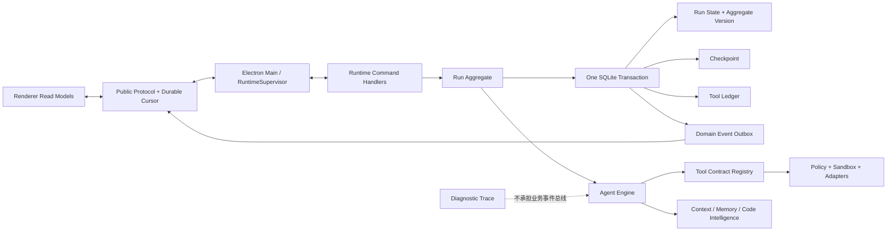

# Ariadne Agent 成熟度差距、模块审阅与改进路线

> 文档状态：基线审计 v2
> 审计日期：2026-07-24
> 审计范围：Protocol、Electron App、Runtime 全部顶层模块、测试、发布与治理边界
> 用途：作为后续修复、能力补齐、验收和发布决策的统一清单

## 1. 审计结论

Ariadne 的总体架构方向合理，不需要推倒重来。

当前最成熟的部分是桌面宿主与安全边界：

- 单 BrowserWindow + Dockview；
- Renderer → 最小化 Preload → Electron Main → Node IPC → Runtime；
- Renderer 不直接接触 Node、文件系统、Shell、Runtime Host 协议、PID、端口和密钥；
- Runtime 独占 Agent、模型、上下文、工具、策略和业务数据；
- 工作区路径、权限、计划确认、沙箱和密钥存储具备较完整的控制面。

当前不成熟的部分集中在 Agent 内核闭环：

1. 模型层支持原生 Tool Calling，但 Agent 主路径没有把完整工具 Schema 传给模型。
2. Run 生命周期分散在多个 Store 和状态中心，没有单一权威状态机。
3. Runtime 业务事件仍从 Trace 和多个 Store 轮询推导，没有持久化事件游标和断线重放。
4. 普通运行在进程崩溃后不能从安全 checkpoint 继续。
5. 外部内容信任仍依赖关键词检测和过宽的 `trusted` 标记。
6. Context、Memory、Summary、Embedding 和非 TS 代码理解的默认能力低于模块名称表达的成熟度。
7. SubAgent、Plan、Policy、Sandbox、Scheduler 等复杂模块的直接行为验证不足。
8. 缺少 MCP、Skills、分层项目指令、Browser、附件资源注册表和通用 Headless Agent 协议。
9. 缺少真实模型驱动的任务成功率、安全、故障恢复和长时间运行评测。

因此，当前准确定位是：

> Ariadne 是具有较强桌面宿主和安全边界的 Agent Runtime 平台，但还不是经真实任务证明可以长期自治、崩溃恢复和稳定扩展的成熟 Agent。

后续优先级必须是：

> 状态一致性与真实评测 → 工具协议可靠性 → 崩溃恢复与内容安全 → Context/代码理解 → 扩展生态 → 产品外围功能

## 2. 当前验证基线与限制

### 2.1 已通过的验证

2026-07-24 在当前工作树实际执行并通过：

- Protocol 14 项、Runtime 81 项、App 154 项，共 249 项自动测试；
- Protocol、Runtime、App 全量 TypeScript typecheck；
- Runtime 独立性审计；
- 根依赖和独立 Runtime 生产依赖审计，均为 0 个已知高危漏洞；
- 真实 Electron 窗口和真实 Runtime 子进程启动；
- 工作区授权、会话创建、设置持久化和无模型降级界面；
- Dockview Popout 无高权限 Preload、拒绝不可信窗口和跨页导航；
- Renderer 零控制台错误。

真实窗口证据由 `scripts/electron-smoke.ps1` 生成到 `artifacts/electron-runtime-smoke/`。

### 2.2 这些验证不能证明什么

真实窗口验收中 `readyModelCount=0`，因此当前证据不能证明以下完整链路：

> 真实模型 → Agent 决策 → 原生 Tool Calling → 权限或计划确认 → 文件或命令执行 → 自动验证 → 最终回答

也没有完成：

- 正式签名的 Windows Native Sandbox helper；
- Transformers Runtime 和真实本地模型装配；
- 远程及本地模型的 Tool Calling/流式/错误恢复兼容矩阵；
- 安装、升级、降级、数据库迁移和回滚；
- 完整 `verify:release` 生产发布物签名验证；
- 磁盘满、进程强杀、数据库损坏、事件重复/乱序和网络故障注入。

所以“自动测试通过”“Runtime ready”和“窗口正常显示”都不能被描述成“Agent 已达到生产成熟度”。

## 3. 架构边界与治理约束

### 3.1 应继续保留的边界

- Electron Main 只负责窗口、终端、文件、通知、配置、Runtime 生命周期和协议转发。
- Runtime 负责 Agent、Companion、模型、Context、Memory、Plan、Tool、Policy、Scheduler、SubAgent、Storage 和 Sandbox。
- Protocol 是 App 与 Runtime 唯一共享边界，Public 与 Host 类型继续分离。
- Renderer 只发送命令和维护公开事件投影，不推导隐藏业务状态。
- Runtime 不引入本地 HTTP Server、端口监听、网页测试台或第二套 DesktopHost。
- 会话级模型路由、工作区访问和权限模式继续放在 Chat，不在 Settings 中建立重复控制源。

### 3.2 Ariadne 是唯一项目权威

Ariadne 是独立维护、独立测试和独立发布的项目。当前仓库是 Agent Loop、Tool、Plan、Policy、Context、SubAgent、Scheduler、Sandbox、Protocol、App 和 Runtime 行为的唯一实现与验收来源。

架构治理必须遵守：

- 设计说明只描述 Ariadne 当前模块、当前数据流和当前验收标准；
- 源码、测试、构建和发布只使用当前 monorepo workspace 与固定打包资产；
- 测试必须针对 Ariadne 当前公开契约和领域行为编写；
- 外部资料只能作为通用设计参考，不能成为代码权威、测试基线或发布依赖；
- 架构变化通过 Ariadne 自身 ADR、测试和发布门禁管理。

### 3.3 已修复但必须保留回归的边界

多工作区权限曾因为存在一个只读工作区而全局降级。当前 Host 适配已改为按 `workspaceId + sessionId + runId` 在执行入口解析权限，并覆盖混合只读/可写工作区和缺失映射 fail-closed。

该问题不再列为当前 P0，但以下回归必须长期保留：

- 同时挂载只读和可写工作区时，可写工作区仍能在授权后写入；
- 只读工作区在 Chat、Plan、Scheduler、Background Task 和 SubAgent 入口均无法写入；
- 会话到工作区映射缺失时拒绝执行，不回退为全局权限。

## 4. 当前 P0 缺陷

### P0-01：公开了不存在的 Browser 能力

**证据**

- `browser` capability 存在于公开协议和 Agent 提案契约：
  [public.ts](../packages/protocol/src/public.ts#L146)、
  [AgentHandoffContracts.ts](../runtime/src/assistant/AgentHandoffContracts.ts#L312)
- 内置工具没有 Browser、HTTP、Web Search 或 Computer Use：
  [tools/index.ts](../runtime/src/tools/index.ts#L60)

**问题**

用户可以批准一个 Runtime 实际无法执行的能力，导致 Capability、Permission、Tool Registry 和 UI 契约不一致。

**修改要求**

- Browser 真正实现前，不对外声明该能力；或者
- 实现独立 Browser Service，包含域名策略、DOM/可访问性快照、截图、下载隔离、超时、网络审计、敏感输入保护和权限确认。

**验收**

- 每个公开 capability 至少对应一个健康、可发现、可执行、可审计的工具。
- Capability、Permission、Tool Registry 和 UI 具有自动一致性测试。

### P0-02：原生 Tool Calling 没有接入 Agent 请求

**证据**

- 模型请求和 Provider 适配器支持完整工具 Schema：
  [model/types.ts](../runtime/src/model/types.ts#L31)
- Agent 调用模型时没有传递 `tools`：
  [AgentReactLoopRunner.ts](../runtime/src/agent/AgentReactLoopRunner.ts#L167)
- 文本提示只提供工具名称和扁平字段名：
  [AgentSystemPromptBuilder.ts](../runtime/src/agent/AgentSystemPromptBuilder.ts#L14)

**问题**

支持原生 Tool Calling 的 Provider 仍主要依赖文本 JSON；类型、枚举、必填、嵌套结构和约束没有可靠传给模型。本地与远程模型也因此形成不一致行为。

**修改要求**

建立唯一 `ToolContract`，从同一来源生成：

- Zod 输入和输出校验；
- Provider JSON Schema；
- 不支持工具模型的文本 fallback；
- UI 参数预览和审批描述；
- 权限、风险、副作用、幂等性、并行性和资源作用域。

原生 Tool Calling 作为首选路径，文本 JSON 仅作为明确的降级通道；两条路径必须规范化为同一种 AgentAction。

**验收**

- Provider 兼容矩阵覆盖原生工具、JSON fallback、流式和非流式。
- 无效、未知或越权工具参数永远不会进入执行器。
- 固定工具任务集在所有受支持 Provider 上产生一致的规范化动作。

### P0-03：协议解析失败直接终止 Run

**证据**

一次 AgentAction 解析失败会立即抛出 `AgentProtocolError`：
[AgentReactLoopRunner.ts](../runtime/src/agent/AgentReactLoopRunner.ts#L222)

**问题**

格式噪声、截断 JSON、错误字段或较弱本地模型会让整个任务立即失败。Agent 主路径没有复用 Companion 已具备的有限协议修复思想。

**修改要求**

- 最多允许 1～2 次无副作用协议修复；
- 修复提示只包含 Schema 错误和允许动作，不重复注入完整大上下文；
- 修复成功前禁止执行工具；
- 超过上限后按错误类别决定 Provider fallback 或失败；
- 修复轮次受 Token、成本和总时间预算约束。

**验收**

对缺字段、额外文本、错误类型、截断 JSON、未知工具和无效嵌套参数建立固定回归集。

### P0-04：“批量工具”协议实际串行

**证据**

- AgentAction 支持一次返回多个 `tools`：
  [AgentReactLoopRunner.ts](../runtime/src/agent/AgentReactLoopRunner.ts#L246)
- 执行阶段仍在普通 `for` 循环中逐个 `await`：
  [AgentReactLoopRunner.ts](../runtime/src/agent/AgentReactLoopRunner.ts#L316)

**问题**

协议名称和实际调度语义不一致；直接改成 `Promise.all` 又会制造写冲突、权限竞态和副作用失序。

**修改要求**

工具契约增加：

- `parallelism: parallel_safe | serialized | exclusive`
- `effects: none | workspace_read | workspace_write | process | network`
- `idempotency`
- `resourceKeys`
- 显式依赖关系

只有只读、无依赖、资源不冲突的工具可以并行；写文件、Shell、Git、网络写入和危险操作继续串行。

**验收**

- 只读并行任务明显快于串行基线；
- 结果按原 call 顺序归并；
- 单调用超时、整体取消、部分失败和并发资源冲突均有确定语义；
- 不产生重复或乱序副作用。

### P0-05：Trace 仍承担业务事件总线职责

**证据**

[RuntimeEventBridge.ts](../runtime/src/application/RuntimeEventBridge.ts#L20)当前：

- 每 200ms 观察 Runtime 状态；
- 正常生产路径使用 `TraceIndex` 增量游标读取新 Trace；
- 无索引兼容路径仍读取最近 1000 条并使用有界 ID 缓存去重；
- Permission、Plan 和 Run 变化从多个 Store 与 Trace 推导；
- 轮询错误不终止 Runtime，只等待后续轮次重试；
- Host event 只有当前进程递增的 `sequence`：
  [host.ts](../packages/protocol/src/host.ts#L126)
- Public protocol 没有 event replay/ack/cursor command：
  [public.ts](../packages/protocol/src/public.ts#L284)

**已修复的旧问题**

`IndexedTraceCursor` 已修复正常生产路径“只看最近 1000 条导致突发事件漏读”的具体问题。该旧结论不能继续描述为当前生产路径现状。

**仍然存在的问题**

- Trace 是诊断数据，不应成为业务状态变化的事实来源。
- 增量游标和去重状态主要存在于当前 Runtime 进程内，不是公开、持久化的消费者 cursor。
- Runtime 重启后 Host sequence 重新计数。
- Renderer 只收到 Public event 内容，看不到 Host sequence，无法识别事件缺口。
- 状态更新与公开事件写入不在同一个事务中。
- Trace、Run Store 和 Pending Store 形成多个事实来源。

**修改要求**

- 使用 SQLite transactional outbox；
- 状态、checkpoint、工具账本和 domain event 在同一事务提交；
- event 具有稳定 `eventId`、持久 sequence、schema version、aggregate version、correlation 和 causation；
- Renderer 按 cursor 重放并进行幂等投影；
- Trace 只保留诊断职责。

**验收**

- 高频事件、IPC 断连、Renderer 重载和 Runtime 重启后不丢失、不重复应用；
- Event Bridge 不再依赖轮询 Trace 生成业务事件；
- 投影能从空状态通过快照 + cursor 重建。

### P0-06：崩溃恢复不是断点续跑

**证据**

除等待权限或计划的 Run 外，普通 `running` Run 在启动恢复时被标记为失败：
[startupRecovery.ts](../runtime/src/app/startupRecovery.ts#L17)

`RunStore.update()` 可以直接写入任意状态，没有状态转换表或乐观版本：
[RunStore.ts](../runtime/src/orchestrator/RunStore.ts#L49)

**问题**

- 长任务不能跨进程继续；
- 模型已完成但工具意图未持久化时无法安全恢复；
- 工具可能已经产生外部副作用但结果尚未落盘；
- Run、Paused Run、Plan、Permission 和 Handoff 状态可能出现不一致。

**修改要求**

- 建立单一 Run Aggregate 和显式状态转换；
- 在模型轮次完成、工具准备执行、工具执行完成、等待用户动作和最终结束时保存 checkpoint；
- 工具调用使用稳定 idempotency key；
- 只自动恢复已知安全、幂等的步骤；
- 对 Shell、网络写入和外部副作用不确定状态要求用户确认。

**验收**

在模型前后、工具前后、权限等待、计划等待和完成事件前后逐点强杀进程。恢复后不得重复副作用、丢失已确认结果或进入非法状态。

### P0-07：Prompt Injection 采用关键词式信任模型

**证据**

- [injection.ts](../runtime/src/util/injection.ts#L1)只匹配少量中英文短语，只有命中后才包装不可信内容。
- [ContextManager.ts](../runtime/src/context/ContextManager.ts#L335)保存工具消息时统一写入 `trusted: true`；`ledgerBacked` 只影响 `trustBasis`。

**问题**

没有命中关键词不代表内容可信。工具账本只能证明“哪个工具返回了什么”，不能证明文件、网页、Shell、Git diff 或 SubAgent 文本具有系统或开发者指令权限。

一个 `trusted` 布尔值无法同时表达：

- 工具调用是否真实执行；
- 返回内容是否完整；
- 内容是否可以作为指令；
- 数据是否敏感；
- 数据是否允许发往网络。

**修改要求**

每条外部或工具内容默认携带：

- `origin`
- `provenance`
- `integrityEvidence`
- `instructionAuthority`
- `dataSensitivity`
- `externalContent`
- `egressAllowed`

内容中的指令永远不能提升自身权限。建立 secret → network 数据流策略，并让授权界面显示数据来源、目标地址、操作范围和可能外发的数据类别。

**验收**

恶意 README、命令输出、网页、Git diff、依赖文档和 SubAgent 回复不能绕过权限系统；敏感内容默认不进入网络工具、日志和外部遥测。

### P0-08：建立 Ariadne 自有测试基线

**已确认的问题**

2026-07-24 清理前，Runtime 中有两份测试的命名和用例结构没有围绕 Ariadne 当前验收边界设计；App 测试还在断言已经退役的兼容名称和脚本不存在。这些测试主要证明“旧入口已经消失”，不能充分回答“Ariadne 当前契约是否正确”。

**本轮已完成**

- 删除旧的 `agent-handoff-runtime.test.ts` 和 `agent-proposal-capability-policy.test.ts`；
- 使用 [ariadne-handoff-authorization.test.ts](../runtime/tests/ariadne-handoff-authorization.test.ts) 重写当前五档权限策略、一次性授权上限和执行模式测试；
- 使用 [ariadne-proposal-policy.test.ts](../runtime/tests/ariadne-proposal-policy.test.ts) 重写当前 Ariadne 提案能力、显式只读请求和权限策略推导测试；
- 新增 [ariadne-test-boundary.test.ts](../runtime/tests/ariadne-test-boundary.test.ts)，禁止 Runtime 测试通过相对路径依赖当前 Runtime 工作区之外的源码，并固定使用当前 Vitest runner；
- 将 App 的桌面边界和打包测试改为验证 Ariadne 当前 IPC、workspace、portless Runtime 和发布链路，不再断言退役名称或脚本。

**仍然存在的问题**

清理遗留用例不等于测试体系已经成熟。Runtime 仍有大量核心模块缺少直接行为和故障测试，特别是 Agent 主循环、ToolContract、Plan、Policy、Sandbox、SubAgent、Scheduler、Lifecycle、checkpoint 和 event replay。

**修改要求**

- 每个测试必须对应当前 Ariadne 模块、公开契约或明确 acceptance ID；
- 测试不得读取、导入或调用当前 Ariadne 工作区之外的源码、测试目录和测试命令；
- 外部测试只能作为风险样本参考，必须按 Ariadne 当前边界重新设计，不能原样移植后只修改 runner 或命名；
- 建立源码模块 → 单元测试 → 集成测试 → 真实模型/真实机器验收的覆盖矩阵；
- P0 模块先补失败用例和故障注入，再修改实现；
- 发布报告只统计当前提交实际执行的测试，过去版本或其他环境的通过数不得计入当前基线。

**验收**

- `packages/protocol/tests`、`runtime/tests` 和 `app/tests` 不含退役兼容名称、指向工作区外部的绝对路径或外部测试命令依赖；
- Ariadne 测试依赖边界自动检查持续通过；
- P0 模块均有直接行为测试、错误路径和至少一种故障恢复测试；
- 测试名称、fixture、错误码和断言全部对应当前 Ariadne 契约；
- 发布报告能独立复现测试数量、跳过项、真实模型结果和真实机器未验收项。

## 5. 名称完整但默认能力退化的模块

### 5.1 Embedding

默认 Provider 是 256 维词法特征哈希，并明确处于 degraded 状态：
[EmbeddingService.ts](../runtime/src/context/EmbeddingService.ts#L29)

该实现适合离线兜底，但不能被描述为神经语义检索。需要：

- 可配置的本地语义 Embedding Provider；
- Provider 名称、版本、维度、归一化方式和索引指纹；
- 模型切换后的兼容检查和重建策略；
- 远程 Embedding 的隐私开关和批处理策略；
- precision/recall、无关内容注入率和延迟基线。

### 5.2 Memory

默认规则抽取主要识别 TypeScript、中文回复和本地优先：
[MemoryExtractor.ts](../runtime/src/context/MemoryExtractor.ts#L164)

需要：

- 结构化抽取和 Schema 校验；
- 来源、置信度、时间、scope 和适用条件；
- 冲突合并、用户编辑、删除和过期；
- 区分用户明确偏好、模型推断、工具观察和历史事实；
- 防止把工具输出或模型幻觉固化为长期记忆。

### 5.3 Summary

默认摘要主要从固定位置截取用户和助手消息：
[SummaryManager.ts](../runtime/src/context/SummaryManager.ts#L94)

需要按以下结构生成和验证：

- 目标和成功标准；
- 用户约束和已批准权限；
- 已完成工作及证据；
- 重要决策及理由；
- 失败、未决问题和下一步；
- 重要文件、工具调用与结果配对；
- 摘要版本和原消息引用。

### 5.4 Code Intelligence

TypeScript/JavaScript 使用 TypeScript AST，其他语言主要依赖简单正则：
[CodeIntelligenceService.ts](../runtime/src/context/CodeIntelligenceService.ts#L59)、
[CodeIntelligenceService.ts](../runtime/src/context/CodeIntelligenceService.ts#L201)

需要：

- `LanguageService` 抽象；
- LSP 优先、Tree-sitter fallback；
- definition、references、diagnostics、imports 和 rename preview；
- 增量索引、文件失效和 repo map；
- 面向上下文窗口的相关代码打包。

### 5.5 Context Packing

[PromptBuilder.ts](../runtime/src/context/PromptBuilder.ts#L70)使用粗略 Token 估算，并在遇到第一个放不下的 section 时直接 `break`。这会让后面更短、更重要的 section 也无法进入上下文。

当前预算也没有统一覆盖：

- 完整消息历史；
- Provider 工具 Schema；
- 预留输出 Token；
- reasoning 或 Provider 特殊开销；
- 工具结果和附件。

需要使用模型 tokenizer、输出预留、价值/成本排序和可跳过装箱，而不是按顺序遇到超限即停止。

### 5.6 Answer Evaluation

[answer-evaluator.ts](../runtime/src/model-router/answer-evaluator.ts#L24)明确是 `rule_stub`，主要根据空输出和答案长度决定是否 fallback。

长度不能证明任务正确。应改为：

- 是否满足用户约束；
- 是否有工具或测试证据；
- 是否完成所声明的副作用；
- 是否存在未处理错误；
- 是否通过任务专属 validator；
- 是否应该标记 `completed`、`partial` 或 `blocked`。

## 6. Protocol、Electron 与 Renderer 逐模块审阅

| 模块 | 合理之处 | 不合理或缺失 | 推荐修改 |
| --- | --- | --- | --- |
| Protocol Common/Public/Host | Public/Host 分离、严格 Zod、请求 ID、消息大小上限合理 | 单一 `1.0` 常量；事件无持久 ID/replay；Resource 无内容哈希和生命周期；Plan 审批无版本号 | 增加版本协商、feature flags、event cursor、Resource Registry 和 Plan approval version |
| Electron Main | `sandbox + contextIsolation + no nodeIntegration`；导航和 Popout 白名单严格 | Main 同时协调终端、文件、配置和 Runtime，继续扩张会形成第二业务核心 | 固定为 capability broker，不允许 Agent、模型、记忆或计划业务进入 |
| Preload | API 固定、类型化，没有暴露任意 IPC channel | Renderer 收不到 Host sequence、Runtime generation 和 durable cursor | 暴露安全的 `{event, cursor, generation}`，支持重连恢复 |
| RuntimeSupervisor | 独占子进程、握手、有限重启和关闭截止时间合理 | sequence 随进程重置；缺请求幂等、durable replay 和 degraded readiness | 增加 runtime generation、request dedup、event cursor 和健康分级 |
| RuntimeStore | 统一公开状态投影，组件不接触 Host 协议 | 约 727 行单体；并行快照不属于同一 revision；全局只有一个 pending chat turn | 按 Session/Run/Permission/Plan 拆 read model；每会话 pending map；支持 gap recovery |
| Chat | 会话级模型路由、工作区和权限模式位置正确 | 发送时 `resources: []` 固定为空；全局 pending 阻止并发会话 | 增加附件资源注册、每会话并发、提交恢复和任务变更视图 |
| Conversation Sidebar | 工作区树、重命名、置顶、折叠体验合理 | 置顶属于本地桌面偏好，不是 Runtime 业务状态 | 明确偏好语义，避免与会话权威状态混淆 |
| Agent Status | 能展示 Run、工具和审批计数 | 依赖非持久事件投影，重连后只能重新拼装混合快照 | 从版本化 Run projection 构建 |
| Agent Plan | 计划和权限分离正确 | Plan 响应缺少类似 Permission 的 `approvalVersion`，存在陈旧审批风险 | 提交 plan hash、approval version 和 aggregate version |
| Permissions | 有 approvalVersion、一次性/会话/项目/工作区授权 | 未完整展示数据来源、外发目标和副作用不确定性 | UI 增加来源、目标、数据类别、风险和实际执行范围 |
| Tool Output | 与聊天正文分离合理 | 适合短结果，不适合大型输出、二进制或可恢复 artifact | 大输出持久化为 artifact，展示摘要、哈希和打开入口 |
| Logs | 使用脱敏 Public projection 合理 | Trace、审计、业务事件和 Run timeline 混合 | 拆成 Diagnostics、Security Audit 和 Run Timeline |
| Terminal | node-pty 在 Main，Renderer 不接触 Node | 用户可能误认为交互终端与 Agent Shell 共享沙箱 | 明确区分“主机交互终端”和“Agent 沙箱命令” |
| File Explorer | realpath、符号链接和工作区授权边界较强 | 只有浏览，没有 Diff、编辑和附件资源生命周期 | 与 Resource Registry、Diff Viewer 和变更账本整合 |
| Settings | API Key 使用系统安全存储；动态运行选择不与 Chat 重复 | 缺 Provider 健康、能力矩阵和配置快照版本 | 增加测试连接、工具/流式/上下文能力和 config revision |
| Dockview Modules | 单 Renderer 复用模块实例，Popout 不复制 Runtime 连接 | 模块注册只是 UI 模块化，不是可加载第三方插件安全边界 | 第三方 UI 必须进入无 Preload、独立权限的 WebContents |

## 7. Runtime 顶层模块逐项审阅

| 模块 | 合理之处 | 不合理或缺失 | 推荐修改 |
| --- | --- | --- | --- |
| `entry` | Runtime 进程入口单一、职责较窄 | 入口未来容易吸收启动恢复和业务逻辑 | 只保留 bootstrap、signal、shutdown 和 fatal error 投影 |
| `transport` | 只有 Node IPC，不引入 HTTP/端口 | 只有进程内 sequence，没有持久重放和幂等请求 | 增加 generation、event cursor、request dedup 和协议兼容协商 |
| `app` | 作为 composition root 集中组装服务 | `createAppContext` 过大，手工接线难审计 | 按领域拆 factory，输出依赖图和启动健康报告 |
| `application` | Facade 和 Public projection 隔离内部类型 | `RuntimeFacade` 过大，命令、事务、补偿和投影混合 | 拆为具名 command handler；Facade 只分发和统一错误映射 |
| `core` | Run、权限、JSON 和关联 ID 放在中立层合理 | RunStatus 只是枚举，没有合法转换和 aggregate version | 增加 transition table、typed command 和 domain error |
| `agent` | 有预算、取消、暂停、最终声明、工具反馈和工作流拆分 | 127 个文件但原生工具协议仍未闭环；状态流过度分散 | 先稳定单一 Agent state machine，再拆策略和工作流 |
| `assistant` | 提案、能力授权和 handoff 与直接执行分离 | `AgentHandoffStateCenter` 过大，与 Run/Companion 状态重叠；名称含糊 | 并入 Run Aggregate，模块改为明确的 `handoff` 领域 |
| `orchestrator` | Entry、Resume、Plan、Permission 服务边界清楚 | 多个状态仓库和终态总线竞争；仍有历史 `RunHttpContracts` 命名 | 使用 command handler + Unit of Work；移除 transport-specific 历史命名 |
| `plan` | 有 hash、版本、DAG、编译、校验、审批和 replan | 缺直接行为测试；计划执行状态与 Run 状态重复 | Plan 保持不可变；执行进度归 Run Aggregate；补周期、竞态和恢复测试 |
| `tools` | Zod 输入校验、权限、超时、风险、备份和回滚基础较好 | 对外 ToolSpec 只有顶层字段；缺输出 Schema、幂等、并行和数据流 | 建立单一 ToolContract；调用意图和结果原子写入 Tool Ledger |
| `policy` | Workspace、Path、Shell、Network、Permission 和 Plan 分层清楚 | 数据来源信任、secret-to-network 和 egress 分类不足 | 在最终执行边界统一调用 Policy Decision Point，并持久化理由 |
| `sandbox` | Restricted 不可用时 fail-closed；helper 签名和哈希信任设计较强 | 自动测试不能代替正式签名 helper 和真实机器逃逸测试 | 增加干净 Windows、ACL、符号链接、hardlink、进程树和绕过测试 |
| `context` | Session、Message、Summary、Memory、Vector、Index 框架齐全 | 默认语义、摘要、记忆和非 TS 分析均退化；Token packing 粗糙 | 接入 tokenizer、语义 Embedding、结构化摘要、记忆治理和 LSP/Tree-sitter |
| `model` | OpenAI/Anthropic/本地模型、流式、取消、推理参数和 toolCalls 支持较好 | 缺统一 retry/backoff、rate-limit、circuit breaker 和行为矩阵 | 建立 Provider qualification suite 和可重试错误分类 |
| `model-router` | 隐私优先、手动覆盖、成本和可用性路由合理 | AnswerEvaluator 只是长度规则；小型路由集不能证明任务成功 | 使用任务 validator、工具证据和真实 eval 反馈 |
| `model-orchestrator` | single、draft-review、parallel-vote 管线可扩展 | 复杂度领先于验证证据，不能证明多模型净收益 | 默认保持 single-model；只有评测证明收益后启用复杂管线 |
| `companion` | 会话、隐私、Memory、流式协议和 proposal outbox 设计较完整 | Service、Workflow、Storage 过大；跨数据库补偿复杂 | 拆 domain/application/infrastructure；推广 transactional outbox |
| `subagent` | 有任务契约、上下文裁剪、权限上限、预算、并发、workspace lease 和冲突处理 | 29 个文件但直接测试不足；自动合并和崩溃恢复可信度低 | 子任务建成正式 child Run；持久 checkpoint；覆盖取消、权限、冲突和强杀 |
| `background` | 通过 SandboxProcessHandle 管理长进程和输出规则 | 任务与进程主要在内存 Map，重启后无法可靠重新附着 | 增加 execution ledger、进程租约、orphan 检测和明确不可恢复状态 |
| `scheduler` | cron/interval/file/git 触发模型较完整 | Timer 所有权在内存；`GitStatusHub` 直接使用 `child_process.execFile` 绕过统一进程边界 | 所有进程经过 capability broker；增加 trigger lease、misfire 幂等和并发上限 |
| `lifecycle` | Cleanup plan、journal、lock、quarantine 和 privacy purge 完整 | 缺磁盘满、断电、数据库损坏和迁移中断测试 | 建立 fault-injection suite、备份恢复和 migration compatibility matrix |
| `storage` | 公共 SQLite migration 工具减少重复 | Store 分散在各领域，跨 Store 事务边界不明显 | 增加 Unit of Work/transaction context 和数据所有权图 |
| `trace` | 结构化 Trace、索引、分段、查询和脱敏基础良好 | 同时承担诊断、业务事件和 UI timeline | 拆成 Domain Event、Audit Ledger、Diagnostic Trace，再接 OpenTelemetry |
| `config` | 严格 Schema、workspace catalog、生产态禁用开发覆盖合理 | 环境变量、TOML、Runtime profile 和桌面偏好可能产生来源冲突 | 生成不可变 `ConfigSnapshot{id, revision, sources}`，每个 Run 记录版本 |
| `platform` | 路径身份和存储根策略合理 | 原生目录选择等能力直接启动进程，边界不统一 | 建立显式 Host Capability Adapter，并审计绕过 Agent Sandbox 的理由 |
| `cli` | 已有模型、沙箱和存储诊断命令 | 不是完整 Headless Agent 接口 | 增加稳定 NDJSON 命令/事件协议、退出码、cursor 和 CI 模式 |
| `util` | 严格 JSON、timeout、redact 和 public error 可复用 | injection 和正则脱敏不足以承担安全策略 | util 只提供机制；信任、敏感数据和 egress 决策归正式 policy 层 |

## 8. 测试、发布与文档模块审阅

### 8.1 测试

Runtime 当前约有 515 个源码文件、18 个测试文件和 81 项测试。文件数不是覆盖率，但直接依赖扫描显示，Plan、Policy、Sandbox、Scheduler、Background、SubAgent、Lifecycle 和 Tools 等核心目录缺少足够的直接行为测试，当前更多依赖间接集成覆盖。

必须增加：

- Agent Action 和 ToolContract 的属性测试与错误语料；
- Plan DAG、版本竞态、陈旧审批和 replan；
- Policy 组合、权限上限、egress 和 prompt injection；
- Sandbox 路径逃逸、进程树、ACL、符号链接和 helper 信任；
- SubAgent 取消传播、预算、并发、写冲突和崩溃；
- Scheduler misfire、重复触发、时区、重启和无人值守权限；
- Lifecycle 磁盘满、断电、数据库损坏、清理恢复；
- Event outbox 重放、重复、乱序和投影重建。

### 8.2 打包和发布

应保留：

- 固定版本和 SHA-256 的 Node runner；
- 独立 Runtime 生产依赖锁；
- helper manifest、哈希、发布者和签名预检；
- 生产构建强制代码签名；
- 真实 Electron smoke 和签名发布物复验。

仍是发布阻塞项：

- 正式证书签名的 Native Sandbox helper；
- Transformers Runtime 和模型资产完整性；
- 干净 Windows 机器安装；
- 应用升级、降级、数据库迁移和回滚；
- SBOM、许可证、模型资产来源和可复现构建；
- 真实模型 + 工具 + 权限 + 计划 + 取消 + 崩溃恢复全链路。

### 8.3 文档

文档应只描述当前实现和可复验事实：

- 已修复问题移入“回归约束”，不继续列作当前缺陷；
- 自动测试、真实窗口、真实模型和真实机器验收必须分开表述；
- `ready` 只代表 Runtime 就绪，不代表模型可用或 Agent 成熟；
- 所有测试数量、commit、Provider 能力和发布状态都应在发布时重新生成；
- TODO 的复选框只有在代码、自动测试和对应真实验收同时满足后才能完成。

## 9. 成熟 Agent 仍缺少的能力

| 能力 | 当前状态 | 优先级 | 目标 |
| --- | --- | --- | --- |
| 真实任务 Eval Harness | 只有少量路由规则和工程回归 | P0 | 固定仓库任务、真实模型、确定性判定、可重复基线 |
| 崩溃安全恢复 | 普通 Run 启动后失败 | P0 | checkpoint、幂等工具、断点续跑和不确定副作用确认 |
| 原生 Tool Calling | 模型层支持，Agent 主路径未接通 | P0 | Schema 单一来源、原生与 fallback 统一 |
| Runtime Event Journal | Trace/Store 轮询推导事件 | P0 | 事务 outbox、cursor、重放和幂等投影 |
| Token-aware Context | 主要使用字符近似和顺序装箱 | P0 | 模型 tokenizer、输出预留、价值/成本排序 |
| MCP | 未发现客户端和服务器发现机制 | P1 | 动态工具发现、健康检查、授权、版本和隔离 |
| Skills | 未发现项目/用户技能加载器 | P1 | 分层发现、版本、依赖和允许列表 |
| Lifecycle Hooks | 未发现通用 Hook 系统 | P1 | Pre/Post Tool、Session、SubAgent、Stop 等事件 |
| 项目指令 | 未发现分层 AGENTS/override 机制 | P1 | 从仓库根到 cwd 合并并记录来源 |
| LSP/Tree-sitter | TS AST + 其他语言正则 | P1 | 多语言符号、引用、诊断和 repo map |
| Browser/Computer Use | capability 存在但无工具 | P1 | 可控浏览器、快照、截图和网络策略 |
| 附件/多模态资源 | Chat 固定发送空 resources | P1 | 文件、图片、网页的稳定资源 ID、哈希和权限 |
| Headless Agent 协议 | CLI 主要是诊断命令 | P1 | CI 可用 NDJSON command/event/cursor |
| 标准遥测 | 自定义 Trace 为主 | P1 | OpenTelemetry/OTLP、隐私字段控制和 SLO |
| 任务级 Compare/Restore | 有文件备份但无整体任务 checkpoint UI | P1 | 任务变更集、差异审查和恢复边界 |
| 正式发布 | 签名 helper、模型资产和升级回滚未完成 | 发布门禁 | 可验证发布物、兼容矩阵和干净机器验收 |

## 10. 推荐目标架构

### 10.1 单一 Run Aggregate

Run Aggregate 统一拥有：

- 状态和合法转换；
- aggregate version；
- 当前 Agent 轮次；
- 当前计划和步骤；
- 权限/计划等待原因；
- child Run；
- checkpoint；
- in-flight tool effect；
- 完成声明和验证证据。

所有转换由 typed command 驱动，并在一个事务中写入状态、checkpoint、Tool Ledger 和 Domain Event。

### 10.2 单一 Tool Contract

每个工具维护一份契约，至少包含：

- `name`、`version`
- `inputSchema`、`outputSchema`
- `permissions`、`resourceScopes`
- `effects`
- `risk`
- `parallelism`
- `idempotency`
- `dataSensitivity`
- `egress`
- `timeout`
- `supportsResume`
- `providerId`

同一契约派生 Runtime 校验、Provider Schema、文本 fallback、审批 UI、审计和未来 MCP 描述。

### 10.3 事务事件与幂等投影

- 命令修改领域状态时同时写入 outbox；
- Runtime event dispatcher 只读取 outbox；
- Renderer 保存最后 cursor；
- 重连后从 cursor 重放；
- 每个 read model 按 `eventId + aggregateVersion` 幂等应用；
- 快照返回统一 revision，禁止混合时间点拼装。

### 10.4 内容信任与数据流

将以下概念分开：

- 执行是否真实；
- 内容是否完整；
- 内容来自哪里；
- 内容是否可以作为指令；
- 内容是否敏感；
- 内容是否允许外发。

正则扫描只能作为风险信号，不能决定信任等级。

## 11. 真实评测体系

### 11.1 固定任务集

至少覆盖：

- 单文件 Bug 修复；
- 跨文件重构；
- 新增小功能和测试；
- 诊断但不修改；
- 只读代码审查；
- Shell、Git、权限拒绝和一次性允许；
- 计划确认、拒绝、取消、超时和预算耗尽；
- Runtime 强杀和恢复；
- 恶意仓库内容和 Prompt Injection；
- 大型仓库定位与长会话；
- 多工作区；
- SubAgent 并发、取消和写冲突；
- Browser/网络能力实现后的域名、下载和数据外发。

### 11.2 每次评测记录

- 任务成功、部分完成、阻塞或失败；
- 测试、Lint、构建和任务专属 validator；
- Patch 是否最小且符合范围；
- 模型轮次、工具次数、Token、耗时和成本；
- 权限请求、拒绝和用户干预次数；
- 是否越权、泄密或重复副作用；
- 是否能从中断点恢复；
- Domain Event、Audit 和 Trace 是否完整；
- 所用模型、Provider、工具版本、配置快照和 Agent 版本。

### 11.3 评测原则

- 单元测试数量不能替代任务成功率；
- 文本答案长度不能替代任务正确性；
- Mock Provider 不能替代真实 Provider；
- Electron 窗口正常不能替代真实工具链；
- EXE 或真实机器测试被排除时必须记录为“未验收”，不能计为通过；
- 不同模型的结果分别统计，不能用平均值掩盖失败 Provider。

## 12. 分阶段路线

### P0：建立可信执行闭环

- [x] 明确当前 Ariadne 仓库为唯一实现、测试和发布来源。
- [ ] 建立真实任务 Eval Harness 和 Provider 基线。
- [ ] 建立单一 ToolContract，接通原生 Tool Calling。
- [ ] 增加有限协议修复和错误分类。
- [ ] 实现安全的只读工具并发。
- [ ] 用 transactional outbox 替换 Trace/Store 轮询业务事件。
- [ ] 建立 Run Aggregate、合法状态转换和 aggregate version。
- [ ] 实现 checkpoint、幂等工具和崩溃恢复。
- [ ] 修复 Browser capability 与实际工具不一致。
- [ ] 将所有外部内容纳入 provenance、instruction authority、sensitivity 和 egress 策略。
- [x] 清理退役命名和兼容性断言测试，建立 Ariadne 测试依赖边界。
- [ ] 建立当前源码模块到单元、集成、真实模型和真实机器验收的覆盖矩阵。
- [ ] 为 Plan、Policy、Sandbox、SubAgent、Scheduler、Lifecycle 和 Tools 增加直接行为测试。
- [ ] 完成至少一个远程模型和一个本地模型的工具/权限/计划/取消/崩溃真实链路。

### P1：补足成熟 Agent 核心能力

- [ ] 实现 tokenizer 驱动的 Context packing。
- [ ] 接入真正的本地语义 Embedding。
- [ ] 实现结构化摘要和可治理长期记忆。
- [ ] 接入 LSP/Tree-sitter 和 repo map。
- [ ] 增加 MCP、Skills、Hooks 和分层项目指令。
- [ ] 增加 Browser/Computer Use 和 Resource Registry。
- [ ] 提供 Headless NDJSON/CI 接口。
- [ ] 增加任务级 checkpoint compare/restore。
- [ ] 接入 OpenTelemetry/OTLP 和敏感字段控制。
- [ ] 建立 Provider retry、backoff、rate-limit、circuit breaker 和兼容矩阵。
- [ ] 完成 Windows 签名、安装、升级、降级、数据库迁移和回滚。

### P2：产品扩展

- [ ] 自定义 Agent Profile 和专家角色。
- [ ] 更灵活的前台/后台 SubAgent 编排。
- [ ] 跨设备通知和恢复。
- [ ] 团队协作、共享任务和企业策略。
- [ ] 第三方 Plugin SDK 与隔离 UI。
- [ ] 媒体生成等非核心工具。

P2 不得替代或阻塞 P0/P1 的可靠性工作。

## 13. 完成定义

只有同时满足以下条件，Ariadne 才可以从“工程化 Runtime 平台”提升为“可发布的成熟 Agent”：

1. 真实任务集具有按模型和 Provider 区分的稳定成功率基线。
2. 模型协议错误能安全修复，工具参数始终经过同一契约严格校验。
3. 原生 Tool Calling 与文本 fallback 规范化为同一种动作。
4. Run 状态、checkpoint、Tool Ledger 和 Domain Event 在单一事务边界内更新。
5. Renderer 断线和 Runtime 重启后可以按 cursor 重放且不重复投影。
6. 进程崩溃后能从安全 checkpoint 恢复且不重复副作用。
7. Capability、Permission、Tool Registry 和 UI 契约自动一致。
8. 所有外部内容默认没有指令权威，安全评测持续运行。
9. Context、Memory、Embedding、Summary 和 Code Intelligence 的产品表述与默认能力一致。
10. Plan、Policy、Sandbox、SubAgent、Scheduler、Lifecycle 和 Tools 有直接行为和故障测试。
11. 所有测试只依赖当前 Ariadne 工作区，并对应当前模块、公开契约或 acceptance ID。
12. MCP、Skills、Hooks、Resource Registry 和 Headless 接口具有稳定版本和权限边界。
13. Windows Native Sandbox、模型 Runtime、签名安装包、升级和回滚通过干净机器验收。
14. Agent 核心架构、变更所有权和测试责任由 Ariadne 自身 ADR 明确。
15. Runtime 独立性、Host/Agent 分层和 Renderer 安全边界持续通过。

## 14. 文档维护规则

- 每个修复项必须关联设计说明、代码、自动测试和对应真实验收。
- 完成复选框前必须满足验收标准，不能只以代码合并为完成。
- 新能力先建立失败样本和评测，再实现功能。
- 已修复问题移入回归约束，不继续列为当前缺陷。
- 历史 commit、测试数、Provider 能力、模型状态和发布状态必须在每次发布时重新生成。
- 文档明确区分单元测试、集成测试、真实窗口、真实模型、真实机器和签名发布物。
- 测试不得依赖当前工作区之外的源码、测试目录或测试命令；外部用例只能作为风险参考，并按 Ariadne 当前契约重新设计。
- Runtime `ready`、进程存活和 UI 可见都不得被表述为 Agent 任务成功。
- Agent 核心修改必须遵循 Ariadne 自身架构 ADR，并保持 Renderer → Main → Runtime 的单向业务边界。
- 每次发布记录 Eval 基线变化、已知退化和未完成的真实机器验收。
