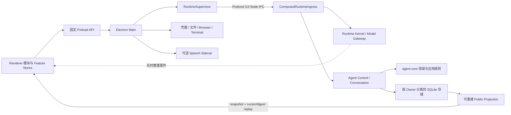

# Ariadne 全局架构审阅与修复计划

> 审阅日期：2026-09-05。状态：R1—R8 本轮修复及本地退出条件已完成；发布环境验收边界见下文。
> 基线：HEAD `00395eda075e5cd762b1c0058351771ab27146d9` 加审阅开始时已有的未提交修改；不是该 commit 的纯净快照。
> 第 1—6 节保留初始审阅证据。后续代码修复和验收以本节为准；没有提交、推送或清理原有工作树。

## 当前修复进度（2026-09-05）

| 项目 | 当前结果 | 验收与边界 |
|---|---|---|
| R1 实时恢复 | 有界缺口缓冲、持久前缀对账、重复/身份校验和真实终止状态；自动重启时重置 Main 事件游标；新增真实窗口丢片、重复及中途重载检查 | 最终真实 Electron 故障恢复与桌面重启均通过 |
| R2 可信基线 | 修正矩阵源码映射；工具链检查查询实际执行的 npm CLI；隔离快照保存全部当前源码，保留原工作树；锁文件在既有约束内更新后两处依赖审计均为 0 漏洞 | Node 24.16.0 / npm 11.13.0 干净安装及完整 reproducible gate 通过 |
| R3 生命周期 | Provider 返回的句柄在输出验证前移交清理所有权；反向清理、原始错误和关闭错误均有测试 | Runtime 全套 883 项已通过 |
| R4 职责边界 | 模型、两个 SQLite UoW、调度器和 Chat 已按内部职责拆分；保留唯一事务 owner、原 schema、exact request 与公共导出；收紧模块行数与事务禁令 | 类型检查、完整测试、结构门禁和最终桌面回归通过 |
| R5 增量状态 | 切片引用缓存、订阅隔离、live 16 ms 批处理及历史行 memo；1k/10k 通知隔离测试和真实 Electron 基准已通过 | 完成本轮目标；万条消息仍全部挂载，首次展示及更新延迟的限制见下表 |
| R6 验证分层 | CI 增加真实 Electron、五 Profile、独立 Node 22 Speech 和带源码摘要的产物；Main、Renderer、测试分别检查；消息行为从源码字符串断言改为真实组件渲染断言 | 本地等价门禁通过；远端 CI 未执行 |
| R7 原型归属 | 四个正式 Profile 排除 `review.visual`，显式 `desktop-preview` 保留预览模块；当前面板读取真实 Public Projection | 最终构建的五 Profile 真实窗口全部通过 |
| R8 文档与旧代码 | `architecture.md` 已列生产、CLI、迁移及纯测试消费者与保留条件；架构、UI、ADR-0011、README、矩阵及验证文档已同步当前入口 | 完成本轮目标；未批量删除仍有消费者的旧代码 |

修复期间真实窗口额外发现 Inbox 入队的目标校验与提交分属两个事务：推理进度并发更新 Run 时会出现内部版本冲突。现在二者在同一 Agent UoW 事务中执行，提交后才通知调度与 Projection；四个并发入队和同 commandId 重放已通过回归测试。

本地最终证据目录为 `artifacts/architecture-remediation-2026-09-05/`。有效结果为 `isolated-ci-final.log`、`isolated-reproducible-final-c.log`、`electron-final-c/`、`profiles-final/`、`renderer-ui-final-c.log`、`speech-node22.log`、`audit-dependencies-final.log` 和 `evidence-final.json`。较早 `electron-f/` 等只证明对应中间版本；失败尝试保留作诊断记录，不能作为通过证据。

固定工具链的全套结果为 **262 个测试文件、1,398 项通过**：contracts 5、protocol 52、agent-core 107、live-work 5、runtime 883、app 346。架构检查扫描 1,109 个 TS/TSX 文件、4,341 条内部依赖边，0 SCC、0 依赖违规；Runtime 独立性扫描 1,118 个生产文件通过。真实 Electron 主流程全部布尔验收项为 true、`fatalError=null`、`consoleErrors=[]`，Provider trace 为 19 请求 / 17 响应 / 2 中止；完整桌面重启的回执恢复与终端显式重启关联同样通过。

### 已完成的结构与性能验收

| Owner 文件 | 审阅时行数 | 拆分后行数 | 当前门禁上限 |
|---|---:|---:|---:|
| `SqliteAgentRunUnitOfWork.ts` | 4,961 | 614 | 700 |
| `SqliteConversationRunHandoffUnitOfWork.ts` | 2,000 | 353 | 400 |
| `ProductionAgentEngineAdapter.ts` | 2,041 | 456 | 520 |
| `AgentRunWorkScheduler.ts` | 1,303 | 681 | 760 |
| `ChatPanel.tsx` | 1,095 | 838 | 930 |

拆出的内部 reader、writer、校验器有各自边界门禁，不拥有新的连接、事务或重试策略。现有数据库无需迁移。Runtime 全套已通过 163 文件、883 项测试，覆盖命令重放、CAS、回滚、受保护载荷、调度与恢复；App 全套 77 文件、346 项通过，最终隔离 gate 已覆盖所有 workspace。

`npm run bench:renderer-history` 可重复创建真实 Electron 窗口，用生产消息组件展示 1,000/10,000 条历史消息，并测量 20 次可见增量更新。每个场景使用独立 Renderer；测量包含 React 更新及下一次绘制，内存来自 Electron 进程指标。参考负载会重新生成历史节点并渲染全部消息；它用于隔离结构共享与 memo 的收益，**不是历史 Git 版本的完整产品跑分**。

| 历史条数 | 全量重算参考 P95 | 当前增量路径 P95 | 当前首次展示 | 参考 / 当前 Renderer 工作集 |
|---|---:|---:|---:|---:|
| 1,000 | 106.9 ms | 11.2 ms | 243.2 ms | 302.0 / 211.5 MiB |
| 10,000 | 965.2 ms | 62.2 ms | 1,890.9 ms | 1,138.5 / 758.4 MiB |

测量设备为 Core Ultra 7 265K、约 15.35 GiB 内存，Electron 43.1.1，窗口 1280×900。结果和源码摘要保存在 `artifacts/renderer-history/renderer-performance.json` 与 `source-evidence.json`。四个场景均断言增量文字实际可见；通知隔离测试还验证 100 个 live 事件合并为一次消息通知，而 Session、Model、Decision、Run、Diagnostics 通知为零。这里没有声称所有历史内容都已虚拟化：当前会话仍完整挂载，万条消息不保证 60 fps，首次展示和内存仍是后续产品规模优化的明确边界。本轮采用可重复行为条件作为门禁，耗时数值是这台机器上的测量，不作为所有 CI 机器的硬阈值。

### 验收范围

本轮仅修复 R1—R8 涉及的已有能力，不等于完成商业 Provider、真实语音设备、签名安装包或干净机器升级/回滚的发布验收。Speech 已在独立 Node 22.23.2 上通过 6 项纯逻辑测试；没有访问用户模型账号或日常应用数据库。CI 工作流已落地，远端运行仍需正常提交后的 CI 事件，本轮未推送或发布。

工作区同期 UI 改动已纳入集成检查：弹窗 smoke 根据外层原生 `dialog` 的实际语义定位内容；终端重启 smoke 完成新增的显式确认交互。`test:renderer-ui` 已接入 CI，本地 101 条真实组件窗口检查通过，覆盖弹窗键盘/焦点、下拉菜单、工具结果分页、目录键盘操作、标签溢出、缩放及同源 HTTP fixture 的独立窗口。保留有意义的结构禁令，不用旧的源码拼写约束替代这些行为检查。

## 1. 总体判断

**核心架构方向合理，已有可信的生产闭环，值得保留；当前的恢复细节、复杂度控制和交付证据还没有完全收敛。建议定点修正，不建议整体重写。**

项目已经具有独立 Runtime、明确的领域写入权威、持久化命令和副作用语义，以及实际穿过 Electron/Main/Runtime/SQLite 的恢复测试。这些是可维护 Agent 产品所需的基础，不只是目录分层或架构图。

主要不足是：新增实时通道没有完整实现与持久投影的对账；组件装配失败存在清理遗漏；大型实现文件与全局 Renderer 状态仍集中承担多种职责；默认产品入口混有原型；文档和验收矩阵落后于实现。依赖图无环能够证明部分边界成立，不能证明这些行为正确。

| 维度 | 评价 | 依据与限制 |
|---|---|---|
| 进程与信任边界 | 良好，应保留 | 固定 Preload、Main 能力所有权、独立 Runtime；窗口开启隔离与 sandbox，IPC 校验发送者主 frame |
| 领域与持久化 | 基础扎实，维护成本偏高 | Conversation、Agent Control、Projection 分别拥有写入权威；大 UoW 仍集中大量事实校验和行操作 |
| Agent 执行与恢复 | 主链路已形成，局部协议有缺口 | 工具、权限、取消、强杀恢复的真实窗口门禁通过；实时流断点恢复专项复现失败 |
| 组件装配 | 有实际约束，生命周期需修正 | service 声明、依赖图、启动顺序和反向关闭有效；失败句柄未进入清理集合 |
| Renderer 状态设计 | 权威边界基本清楚，增量更新不充分 | Feature Store 是窄接口，但订阅和快照失效仍汇集到总 RuntimeStore |
| 产品与交互设计 | 工作台结构清晰，成熟度展示需收口 | 对话、状态、工具面板分工明确；可视化审查限制在预览 Profile，使用真实 Projection 数据 |
| 工程验证与发布 | 自动化基础较强，发布尚不合格 | 1,374 项测试和真实 Electron smoke 通过；发布契约、源码复现检查失败 |

这里的“良好”是结合当前产品目标作出的工程判断，不是量化质量评分。没有发现足以要求推翻进程边界或领域模型的证据，也没有证据支持“已经可以正式发布”。

## 2. 审阅范围与证据等级

覆盖 root workspace、`app`、`runtime`、四个共享 package、Speech Sidecar、架构门禁、CI、打包契约及当前文档。方法是全局依赖扫描、关键生产纵向链路抽查、现有完整测试、隔离的真实窗口检查，以及针对可疑边界的最小行为复现；不是逐行安全审计。

证据分为：

- **已复现缺陷**：直接执行当前源码，得到违反契约的结果。
- **已测量结构债务**：源码和依赖关系可以确认；不等于已经发生性能或数据故障。
- **未验收能力**：没有本轮真实环境证据，不能仅由 Catalog、类型或历史文档认定已完成。

扫描统计：架构脚本检查 1,057 个 TS/TSX 文件、4,145 条内部依赖边、2,292 个类型导入；0 SCC、0 循环边、0 依赖规则违规；允许的 adapter → control/ports 类型导入为 47 个。Catalog 为 Agent 16、Runtime capability 7、UI 12、Speech 8。Runtime 独立性审计扫描 1,066 个生产文件。

这组 TS/TSX 文件按换行统计约 201,926 行，包含源码目录内的 smoke 支持及保留的旧实现；不包含所有 native C#、Speech MJS 和模型资产，不能当作整个产品有效业务代码量。

### 本轮实际验证

| 检查 | 结果 | 结论边界 |
|---|---|---|
| `npm.cmd run typecheck` | 通过 | 当前依赖安装下的 TypeScript 检查 |
| `npm.cmd test` | 通过，258 个测试文件、1,374 项测试 | contracts 5、protocol 52、agent-core 107、live-work 5、runtime 876、app 329 |
| `npm.cmd test --prefix speech-runtime` | 通过，6 项 | 协议、关键词和音频处理；没有验收真实麦克风、声学模型或播放设备 |
| `npm.cmd run check:architecture` | 通过 | 包括 Catalog、依赖方向、循环和热点边界检查 |
| `npm.cmd run audit:runtime-independence` | 通过 | 没有入站 HTTP、外部源码根或外部 file dependency 指标 |
| `npm.cmd run build` | 通过 | 当前工作树完整构建 |
| 构建后执行隔离 `scripts/electron-smoke.ps1` | 通过 | 真实 Electron、Main、Runtime、SQLite，确定性 HTTPS Provider fixture |
| `npm.cmd run verify:release-contract` | **失败** | 验收矩阵指向已不存在的源码，见 R2 |
| `npm.cmd run verify:source-snapshot` | **失败** | 当前 npm 12.0.2 与要求的 11.13.0 不符；工作树不干净 |
| R1/R3 最小行为复现 | **确认缺陷** | 直接导入当前 TypeScript 模块，无外部 Provider、真实数据库或用户数据 |

源码复现失败中的工作树状态是本次审阅的既有条件，不是建议清理或丢弃用户修改。Node 为要求的 24.16.0。本轮通过的测试属于当前 npm 12.0.2 环境，不能据此宣称固定 npm 11.13.0 的干净安装已复现。

真实 Electron 结果确认：分片在最终完成前出现在 DOM、图片消息、同 Run inbox continuation、ask-user、权限 allow/deny、取消，以及五个 Runtime 强杀边界均通过；另一次桌面启动验证了发送回执和终端显式重启恢复。`fatalError=null`，Renderer `consoleErrors=[]`。这些测试不包含本轮新发现的实时流丢片与中途订阅场景。

未执行：真实商业 Provider 验收、真实 MCP OAuth/Browser 隔离验收、真实语音设备测试、四 Profile 完整矩阵、签名安装包、干净机器安装/升级/回滚；没有使用商业账号凭据，也没有操作日常应用数据。

## 3. 当前架构与应保留的设计

图中的实时事件也经过现有 IPC/Main/Preload，不是 Renderer 到 Runtime 的额外直连。它是低延迟展示通道；持久 Projection 和最终 Message 应继续决定恢复及终态。

关键证据入口：

- `runtime/src/entry/runtime-process.ts:1`、`composition/createComposedRuntimeIngress.ts:17`：默认入口装配 Runtime Kernel 与 Agent Control。
- `runtime/src/composition/ComposedRuntimeIngress.ts:88`、`:267`、`:519`：初始化、命令生命周期与关机编排。
- `app/src/main/windows/main-window.ts:34`、`ipc/register-ipc.ts:364`：窗口隔离配置与 IPC 发送者校验。
- `packages/component-contracts/src/service-scope.ts:10`：组件仅可读取声明的 service，服务输出先验证再原子发布。
- `runtime/src/composition/agent-entity/components/persistence/AgentPersistenceComponent.ts:98`：分别创建持久化 owner，启动失败回滚已创建资源。
- `runtime/src/adapters/persistence/SqliteAgentRunUnitOfWork.ts:1276`：命令幂等、版本与事实校验集中在事务提交入口。
- `runtime/src/adapters/persistence/SqliteTransactionOwner.ts:25`：共享串行化、事务和 SQLite owner 生命周期。

应保留的架构选择：

1. Main 管桌面能力与凭据；Runtime 管 Agent 业务；Renderer 消费 Public DTO。
2. Conversation、Agent Control 和 Projection 各自拥有权威，跨边界通过 durable handoff/outbox 协调。
3. 外部副作用遵循 intention、执行、结算及 uncertain 恢复，不把超时等同于“没有执行”。
4. Projection 是可重建读模型，最终 Message 是正式答案权威。
5. ECA 用作静态组件装配、依赖声明和生命周期约束；保持核心领域事实在领域 owner 内。
6. Speech 可选且由独立 Sidecar 承载；已有组件故障隔离方向值得保留。

不建议为减少目录或文件数量合并数据库权威、不建议引入新的分布式服务，也不建议把每个内部函数都升级为 ECA 组件。组件目录数量不是扩展性或完成度指标。

## 4. 修复清单

优先级定义：P1 为影响核心交互恢复或阻断交付的已确认问题；P2 为局部正确性、维护性或验证缺口；P3 为可以随后收口的治理问题。本轮没有足够证据提出 P0。

| ID | 优先级 | 类型 | 问题 | 完成标准 |
|---|---|---|---|---|
| R1 | P1 | 已复现 | 实时流无法跨缺口收敛，旧缓存遮蔽新投影 | 中途订阅、漏片、重复、终止及重载均从持久权威恢复 |
| R2 | P1 | 已复现 | 发布契约被失效的源码映射阻断 | 当前矩阵与 Catalog 一致，release-contract 通过 |
| R3 | P2 | 已复现 | Provider 输出校验失败遗漏关闭当前句柄 | 已启动句柄在任何后续失败中恰好关闭一次 |
| R4 | P2 | 结构债务 | UoW 与模型 Adapter 集中多种职责 | 按职责拆分实现，保留同一事务和 exact request 语义 |
| R5 | P2 | 结构债务 | 每个实时分片使全局快照与 Feature selector 失效 | 无关切片引用稳定、通知隔离，有长会话测量证据 |
| R6 | P2 | 验证缺口 | CI 没有覆盖关键真实窗口和独立 Speech 测试 | 分层自动门禁，行为证据与源码结构断言分开 |
| R7 | P2 | 产品范围 | 默认 Profile 包含模拟可视化审查 | 原型归属明确；正式能力以真实数据闭环验收 |
| R8 | P3 | 治理债务 | 旧应用栈与有效文档边界未收口 | 保留实现有明确消费者，当前文档与生产入口一致 |

### R1：修正实时流与持久投影的对账协议

**位置：** `app/src/renderer/src/core/runtime/live-inference-stream-store.ts:36`、`live-inference-message-projection.ts:10`、`:27`，以及 `runtime-store.ts:215`、`:329`。生产实时事件由 `runtime/src/application/RuntimeKernelApplication.ts:167` 的进程内 sink 推送，没有为新订阅者提供该 attempt 的历史 replay。

已复现：

| 输入 | 当前结果 | 应满足的契约 |
|---|---|---|
| 新 Store 首次接收 sequence 2，随后 3 | 两次均报 `live_inference_stream_sequence_invalid` | 中途订阅应能从持久投影获得起点 |
| 接收 1，漏掉 2，再接收 3、4 | 停留在 1，后续持续报错 | gap 应触发有界对账，不能永久阻塞该 attempt |
| 重复接收 1 | 报序列错误 | 内容和身份相同的重复应幂等；冲突重复另行拒绝 |
| live 保存 `A`，同 ID 的持久投影已保存 `ABC` | 展示仍为 `A` | 更新的持久权威不得被较旧缓存遮挡 |
| live 已接收 `committed` 终止事件 | presenter 强制输出 `streaming` | Attempt 终态不能转换成正在流式输出；正式协议状态为 `committed`/`interrupted`，初始复现中的 `completed` 用词已纠正 |

原因是三处契约缺失共同作用：Store 从 1 开始严格接收却没有初始化/补齐入口；catch 只设置错误；presenter 只按 stream ID 选择 live，既不比较 sequence，也强制覆写状态。定期拉取持久 Projection 已存在，但同 ID 新投影仍会被 live 覆盖，因此仅缩短轮询间隔不足以修复。

影响是当前 attempt 的展示可能停留在旧内容，或结束后仍显示流式状态。已有正式终态消息/Run 到达时会移除部分 live 状态，因此**没有证据表明最终答案或数据库已丢失**。中途订阅和丢片的完整 Electron 故障注入仍需新增，当前确认来自实际模块组合复现与生产调用链核查。

修复边界：在 Renderer Runtime 层建立一个明确的 attempt 合并器。输入包含 durable head、live suffix、完整身份及 sequence；由它决定当前展示，不在 `ChatPanel` 增加文本替换或案例判断。

建议语义：持久 head 提供已知前缀，live 只贡献连续且更新的后缀；相同重复幂等；缺口请求现有 Projection 对账；序列落在 retention 之前时采用有界 suffix/reset 契约；持久终态与 Runtime epoch 重置优先。保留“分片无需等待批量投影即可展示”的能力。

验收必须覆盖：新订阅从 N 开始、1→3 缺口、重复、身份冲突、持久 head 超前、terminal 先于最终 Message、tool continuation 多 attempt、Renderer reload、Runtime restart；在真实 DOM 断言内容继续前进，且已经完成的 attempt 不再旋转。不要通过回退到最终消息才显示来让测试通过。

### R2：修复发布证据映射与工具链复现边界

**位置：** `docs/verification-matrix.json:221`，`scripts/verify-release-contract.mjs:65`。

失败项是 `runtime-capability-manifest` 引用已经不存在的 `runtime/src/composition/runtime-capabilities/ProductionRuntimeCapabilityProviders.ts`。当前生产 Provider 已通过 `ProductionRuntimeCapabilityCatalog.generated.ts` 和组件目录组织。

修改矩阵时应映射当前真实装配入口、生成 Catalog、对应生产定义与 compiler 测试；核对整行能力含义。不要创建同名空文件、恢复过时聚合器，或放宽文件存在性检查。

同时区分两个结论：修复映射使发布契约可执行；真实模型、签名安装和干净机器验收通过，才支持相应发布声明。`currentGate.status=verified` 只是矩阵内的既有声明，不能替代当前命令结果。

工具链问题另行处理：在保留当前工作树的前提下，使用固定 Node/npm 的隔离环境执行干净安装验证。不要为本轮 npm 12 测试通过而直接改写仓库版本契约，也不要自动清理用户修改。

验收：release-contract 通过；固定工具链环境中执行完整 reproducible gate；矩阵中的未验收项保留准确状态和证据来源。

### R3：让资源所有权从 start 返回时立即进入失败清理范围

**位置：** `runtime/src/composition/runtime-capabilities/RuntimeCapabilityManifestCompiler.ts:56`，`RuntimeCapabilityServiceResolver.ts:40`。

当前顺序为 `start → 校验/发布 handle.services → started.push`。如果 Provider 已成功启动资源，但输出漏掉 required service 或含未声明输出，校验抛错时当前 handle 尚不在 `started` 集合。catch 只逆序关闭此前的组件。

最小复现声明一个 required service，`start` 返回带 `close` 的句柄但不给出该 service，结果为 `started=1, closed=0`。确认的是**清理回调遗漏**；没有在日常进程中测量真实 OS 资源泄漏。

修复：`start` 成功返回有效可管理句柄后，立即登记回滚所有权，再执行输出校验和原子发布。对于 `start` 自身分配资源后抛错，Provider 仍负责清理尚未交出的资源。不要把部分输出提前暴露给下一个组件。

验收：缺失/未声明 service、非法 capability、后续 Provider 启动失败、最终 Manifest 校验失败均逆序关闭全部已返回句柄且恰好一次；一个 close 抛错不能跳过其他 close；保留原始失败及清理失败证据。

### R4：按职责拆分热点，保留事务原子性

**已测量热点：**

| 文件 | 行数 | 集中的职责 |
|---|---:|---|
| `runtime/src/adapters/persistence/SqliteAgentRunUnitOfWork.ts` | 4,961 | Run/Receipt/Checkpoint/Effect/Directive、受保护载荷、command facts 与批量持久化校验 |
| `runtime/src/adapters/persistence/SqliteConversationRunHandoffUnitOfWork.ts` | 2,000 | 会话/消息、handoff、事务提交与数据访问 |
| `runtime/src/adapters/model/ProductionAgentEngineAdapter.ts` | 2,041 | 历史物化、图片/Tool 输入恢复、token 预算、推理流、协议解析及控制 Tool schema |
| `runtime/src/composition/AgentRunWorkScheduler.ts` | 1,303 | 持久 work 的调度协调 |
| `app/src/renderer/src/modules/chat/ChatPanel.tsx` | 1,095 | 对话展示、Composer、模型、附件和交互状态 |

文件大本身不构成 bug。问题在于变更理由不同的逻辑仍在同一单元内，使审查和回归范围扩大。当前热点门禁允许 Agent UoW 5,000 行、Conversation UoW 2,025 行，多个组件接近上限；上限只能防止继续膨胀，不能代表职责已经合理。README 对 Factory 仍写 830 行，而当前实际为 135 行，也说明历史描述没有同步。

建议先拆模型 Adapter 中的历史物化、exact request 准备、Provider 响应/Directive 解析和 Tool schema 构建。它们各自消费窄输入，保留 admission-pinned identity、授权 scope、request digest 与 token 计数。不要创造另一套推理 Gateway。

然后把 UoW 的 row mapper、受保护 payload reader、提交校验器和事务内 writer 拆到内部模块。**数据库连接、owner lease、BEGIN/COMMIT/ROLLBACK 和多事实原子提交仍由同一个 transaction owner 控制。** 内部 writer 不开放独立提交，也不分别重试同一 command 的局部写入。

验收以行为不变量为主：command replay、CAS 冲突、错误回滚、effect uncertain、跨边界强杀恢复及同 Run continuation 不变；子模块不反向引用 UoW 具体实现。最后再收紧热点上限，不能用重新分配行数代替边界验证。

### R5：让 Feature Store 获得真正的订阅隔离

**位置：** `runtime-store.ts:329`、`:527`、`:532`；`features/feature-snapshot-store.ts:17`、`:26`。

每个 live chunk 调用总 Store 的 `publish()`；`createSnapshot()` 重新映射 messages、sessions、models、runs、decisions、diagnostics，并合并排序消息。FeatureSnapshotStore 只比较总 source snapshot 的身份，再执行返回新对象的 selector，订阅也直接转发总 Store。

因此 API 已按 feature 拆开，但一次消息增量仍会导致其他切片快照失效。这是可以从调用链确认的更新放大；**本轮没有记录帧耗时、峰值内存或长会话卡顿，不能给出性能退化倍数。**

修复：保留单一持久 Projection 权威，让 projection collection 和派生 selector 支持结构共享；仅相关切片变化才通知相应消费者。live preview 独立按 attempt 更新，在展示边界按帧批处理高频通知，domain event/持久化处理不按帧丢弃。

验收：只增加 token 时，model/session/decision 选择结果引用保持稳定；不相关模块没有订阅通知；对 1,000/10,000 条历史消息及持续 token 流记录消息延迟、渲染次数和内存。阈值在目标硬件测量后制定，不先填没有依据的毫秒指标。

### R6：把静态门禁与真实行为门禁分层

**位置：** `.github/workflows/ci.yml`、root `package.json`、`app/vitest.config.ts`、`speech-runtime/package.json`。

当前 CI 运行源码快照、架构、类型、测试、独立性和 release-contract；没有运行真实 Electron 或 Profile matrix。Speech 是独立 Node 22 Sidecar 项目，不在 root workspaces/root test 链中，本轮需要另外执行它的 6 项测试。

App 测试环境为 Node，73 个测试文件中 29 个包含文件读取调用；抽查 `bottom-edge-layout.test.ts` 可见大量源码/CSS 字符串断言。这并不表示这 29 个文件都没有行为测试，结构边界断言也有价值；但它们不能代替实际 DOM、布局与恢复行为。本轮“所有已有测试通过但 R1/R3 仍可复现”是明确的覆盖缺口证据。

建议：普通 PR 保留快速类型/领域/协议/架构门禁，并运行独立 Speech 纯逻辑测试；在受支持的 Windows runner 中配置确定性 Electron smoke 和四 Profile 检查。真实商业 Provider、语音硬件、签名安装和干净机器升级作为独立验收层，各自写明凭据、资产和环境条件。

给验证结果绑定源码版本或工作树内容摘要、工具链和 Profile。固定字符串断言保留在依赖与权限禁令等结构契约处；布局、交互和状态切换用实际窗口断言。CI 基础设施不具备某种环境时，明确标记未运行，不能由静态测试代签。

### R7：从默认产品路径中明确划分原型

**位置：** `app/src/main/profiles/application-profiles.ts:8`、`app/src/renderer/src/modules/visual-review/index.ts:4`、`VisualReviewPanel.tsx:29`。

`review.visual` 被四个桌面 Profile 共用的 UI 列表纳入，并有主导航入口；Panel 直接读取 `MOCK_REVIEW_SESSION`，发送动作仅设置本地 `sentNotice`，没有真实 Runtime 数据/命令 consumer。`consumes` 与 `requiredCapabilities` 均为空。

页面已有明确“UI 原型 · 全部为模拟数据”和不会真实发送的说明，**不应指控它伪造真实执行**。问题是产品默认路径与实验范围混合，而当前 UI 架构文档又禁止占位 Mock 能力进入正式产品。

建议近期将它分配到显式 preview/dev Profile；若保留默认可达，则产品导航和能力目录必须明确归类为实验原型。不要为了隐藏模块而删除公共 Runtime health、恢复或安全基础设施。

真正接入时复用 Run/Activity Projection 定位事件，按 owner 从 protected Tool Result detail 获取正文，通过已有 Agent inbox 提交引用。不得把完整文件或 Tool 正文复制进 Public Projection。无会话、无权限、正文过期和服务不可用都需要明确空态；“发送成功”只能由真实回执驱动。

真实窗口截图还显示工作台同时展示多处 Runtime/模型/Agent 状态；其中“Runtime 就绪”与“模型检查中”可以合法共存。不能凭单张强杀恢复后的截图判定状态错误。设计上建议将进程可用、模型可用、当前任务状态按用户下一步操作组织，并统一恢复提示语言；窄窗口、键盘操作和缩放需要另行验收。

### R8：收口旧实现与有效文档

保留的 `runtime/src/app/createAppContext.ts` 仍装配旧 Context/Plan/Orchestrator/Companion 服务，`application/createRuntimeContext.ts` 仍调用它。本轮 `runtime/src` 静态搜索没有找到后者的调用方；当前生产 Node IPC 与 Headless 入口使用 Runtime Kernel。**不能把保留源码直接等同于两个控制平面同时运行。**

对旧实现建立最小清单：当前生产 consumer、CLI consumer、迁移/恢复 consumer、纯测试 consumer。没有明确消费者的部分再安排移除；迁移读取、数据校验、密钥与健康设施不能因为位于旧目录就批量删除。评估打包时也应依据实际 entry closure。

文档已有具体漂移：`docs/ui-architecture.md:16` 仍称没有完整生产 Diagnostics publisher，`:63` 仍称真实窗口只覆盖桌面壳；`docs/architecture.md:134` 仍描述凭据环境槽位；当前命令表未覆盖新模型资格命令；验收矩阵仍描述只通过 Projection wake 的流式展示。默认生产代码、测试和新的实时通道已超出这些描述。

修复时更新当前架构、UI 架构、ADR-0011、验证矩阵及 README，分别写清稳定不变量、已接线能力与最近一次证据。日期审计只作为快照；本文件作为当前修复入口维护，不继续累积多份相互冲突的 TODO 报告。

## 5. 实施顺序与拆分边界

| 阶段 | 内容 | 主要归属 | 退出条件 |
|---|---|---|---|
| A：先恢复可信基线 | R1、R2、R3，分开小变更 | Renderer Runtime、发布矩阵、Capability compiler | 新复现转换成回归测试；真实窗口新增流式断点场景；发布契约恢复 |
| B：缩小回归面 | R6、R7 | CI、Application Profile、产品导航 | 分层门禁可重复；原型归属清晰；正式路径不存在模拟回执 |
| C：降低修改成本 | R4，随后 R5 | persistence/model adapter、Renderer state | 事务不变量不变、窄输入边界成立、切片通知隔离且完成测量 |
| D：清理认知负担 | R8，并在前面各阶段同步相关文档 | Composition、旧目录、文档 | 当前事实只有一个维护入口，保留旧代码有明确消费者 |

R1 和 R3 都应先固定失败用例，再修正最早产生错误的 owner。A/B 不依赖整个 UoW 重构；不要将紧急正确性修复绑进大规模文件搬迁。

每个实现变更明确写出：触发条件、原来/现在的行为、受影响 owner、迁移需求和验收证据。R1、R2、R3、R5、R6、R7 通常不需要数据库迁移；R4 首轮也应维持 schema 与存储格式。若实现过程改变 schema，则单独评审迁移与回滚，不默认扩大范围。

本轮建议的修复不是要求立即完成所有功能。先让既有核心链路正确、可恢复、可重复验证，再决定新增能力范围。

## 6. 本地证据与复查方式

证据位于 `artifacts/architecture-review-2026-09-05/`，该目录是被 Git 忽略的本地产物，不是随文档提交的发布证据：

- `npm-test.log`、`build.log`、`source-snapshot.log`：本轮命令输出。
- `reproduce-findings.mjs`、`reproduction-results.json`：R1/R3 的无外部依赖行为复现。
- `electron-smoke/electron-runtime-smoke.json` 和同名 PNG：真实窗口与运行链路结果。
- `electron-smoke/renderer-reload-delivery.json`、`desktop-restart-delivery.json`：重载及完整桌面重启结果。

`reproduce-findings.mjs` 断言的是审阅时的错误行为，只保留作历史诊断；它不再适用于修复后的接口，也不是当前验收命令。相应正确预期已进入正式的 live stream / RuntimeStore、Capability compiler 和真实 Electron 回归测试。当前复查使用 root `verify:reproducible`、`test:electron`、`test:electron-profiles` 和 `bench:renderer-history`；固定工具链及隔离源码要求见 [source-reproducibility.md](./source-reproducibility.md)。

源码行号对应本次未提交工作树，后续会漂移；修复时同时按符号名称定位。文档中的缺陷复现不依赖历史审计结论。
