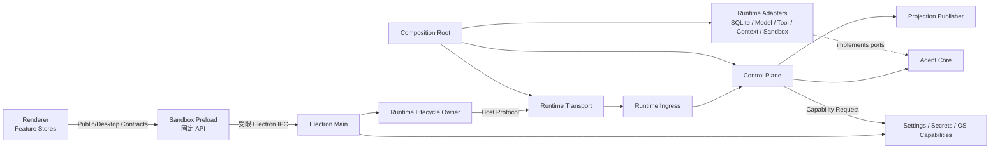
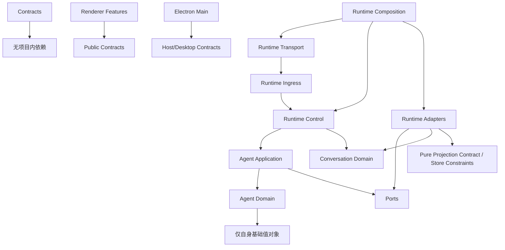
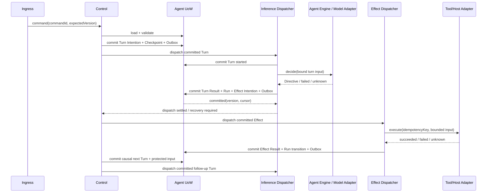

# Ariadne 独立目标架构

- 状态：Accepted target architecture
- 决策日期：2026-07-31
- 最近核对：2026-08-26
- 适用范围：当前 Ariadne monorepo
- 唯一事实来源：当前仓库中的代码、契约、ADR、测试和发布资产

## 1. 设计结论

Ariadne 是独立设计、独立实现、独立发布的桌面 Agent 产品。架构不以任何外部历史项目为源码、兼容目标、同步目标或行为基线。

本文定义 Ariadne 的长期架构不变量。当前生产接线和能力状态以
[当前实现架构](architecture.md) 与 [验收矩阵](verification-matrix.json) 为准；
外部历史项目不属于迁移范围、协议边界、测试基线或发布验收条件。

本架构针对的 2026-07-31 重构启动基线问题是：

1. 同一 Run、Decision、Plan 和恢复状态由多个 Store 与 Coordinator 重复解释。
2. `RuntimeFacade`、`AppContext`、`AgentLoop` 和 Renderer `RuntimeStore` 过大，职责跨越领域、持久化、生命周期和表现层。
3. 工具、权限、模型推理、SubAgent、Checkpoint 和 UI 事件处于同一调用图，导致修改扩散。
4. 新 Agent Control 已创建，但公共命令仍主要进入旧执行路径，形成影子控制面。
5. Renderer 会补查或推断缺失领域状态，掩盖 Runtime 内部不一致。

目标不是继续给现有调用链增加判断，而是逐个垂直切片替换错误边界，并在切换后立即删除对应旧路径。

## 2. 重构启动审计基线

以下数据是 2026-07-31 开始本轮重构时的快照，用于衡量重构是否真正降低复杂度，不作为长期可接受的债务：

| 指标 | 当前值 |
|---|---:|
| 生产 TS/TSX 文件 | 690 |
| 内部依赖边 | 2,755 |
| 强连通循环组件 | 2 |
| 循环内文件 | 55 |
| 循环边 | 136 |
| 依赖规则违规 | 12 |
| 旧 Run 直接写入文件 | 14 |
| 旧 Run 直接写入调用点 | 61 |
| 可变 `default*` 实例 | 18 |

主要结构热点：

- `runtime/src/application/RuntimeFacade.ts`：2,675 行，集中路由约 41 种命令。
- `runtime/src/app/createAppContext.ts`：1,019 行，`AppContext` 暴露约 66 个服务。
- `runtime/src/agent/AgentLoop.ts`：944 行，并直接连接 Tool、Policy、Run、SubAgent 和 Finalizer。
- `app/src/renderer/src/core/runtime/runtime-store.ts`：1,269 行，混合传输、缓存、投影和领域修复。
- `runtime/src/agent/RunPolicyTypes.ts`：基础类型反向引用具体实现，是 18 文件循环的中心。

截至 2026-08-26 的当前状态：

- `RuntimeFacade.ts` 已删除；生产入口为 `RuntimeKernelApplication`、`ComposedRuntimeIngress` 和 `DefaultAgentControlRuntimeFactory`。
- Public 命令面已收口到 Runtime status、Projection snapshot/commit replay、v3 Session/Message、v3 Decision 和 v3 Cancel；未知命令不再 fallback。
- Node IPC 与 Headless Transport 只依赖 `RuntimeIngress`；Runtime Command、Conversation、Agent Control 与 Public Projection 数据库物理隔离。
- Agent Control schema v5 / ledger revision 49 持有 Run/Turn/Inference/Decision/Effect、Plan、Budget、Delegation、Child Run、execution intent 和受保护 Turn 输入快照。
- 默认生产 Composition 已装配 exact model inference、immutable Tool Catalog、Effect dispatch、因果 continuation、follow-up inference、work scheduler 和 started-work recovery gate。
- Public Projection v3 的生产 publisher 覆盖 Conversation、Agent Run/Decision 和 Model；Renderer 只使用 snapshot + commit replay。
- Architecture Gate 当前通过：0 SCC、0 循环边、0 规则违规；文件和依赖边数量以命令输出为准。
- 当前真实 Electron Agent smoke 已覆盖 direct、Tool continuation、Decision allow/deny、运行中取消，以及 inference/effect/projection 三个持久边界的 Runtime 强杀恢复；它使用确定性进程外 HTTPS Provider fixture，不代表 Live Provider、本地模型或真实 Browser/MCP 已验收。
- Diagnostics publisher、Context compaction、SubAgent 产品闭环、完整 Hooks/Telemetry/Provider Resilience 等仍未完成，不能因源码存在而视为生产能力。

## 3. 架构原则

### 3.1 一项事实，一个 Owner

业务事实只能有一个可写权威。其他表示形式只能是可重建投影、缓存或诊断数据。

### 3.2 一个命令入口

单 Run 状态变化经过 `AgentRunCommandService`，多 Run 领域命令经过对应的窄 Control Service；二者最终只能调用 `AgentRunTransaction.commitCommand`。任何 Facade、Tool、Renderer、恢复任务或 Event Handler 都不能直接更新 Agent Control 表。

### 3.3 推理与副作用分离

`AgentEngine` 只产生封闭的 Directive。它不执行工具、不写数据库、不发 UI 事件，也不知道 Electron、SQLite、具体 Provider 或 Tool Handler。

### 3.4 事务先于外部动作

外部动作执行前先提交 Effect Intention；执行后再提交 Effect Result。超时只表示结果未知，不能被当成动作未发生。

### 3.5 边界显式、依赖单向

协议、领域、应用、Adapter、Composition、Transport 和 UI 各有固定依赖方向。类型导入与值导入遵守同一规则。

### 3.6 不长期双写

重构以垂直切片切换。一个业务事实、一个 Run、一个命令在任意时刻只能有一个 Writer。数据变更使用一次性离线迁移，不使用长期双写、回退写或静默兼容。

### 3.7 故障必须成为状态

权限等待、预算耗尽、外部结果不确定、进程中断和恢复阻塞都必须是持久化状态，不允许依赖 Trace、日志、内存 Map 或 Renderer 推断。

## 4. 进程边界



| 进程/边界 | 负责 | 明确不负责 |
|---|---|---|
| Renderer | 展示、草稿、选择、布局、消费权威投影 | 领域推断、数据库、密钥、文件系统、Agent 编排 |
| Preload | 暴露固定、类型化、最小化 API | 通用 IPC、任意 channel、业务状态 |
| Electron Main | 窗口、设置、密钥、OS 能力、Runtime 生命周期 | Agent Run、Plan、Effect、模型编排 |
| Runtime Transport | 协议解析、大小/版本校验、请求交给 Ingress | 组装 Store、运行迁移、创建业务 Facade |
| Runtime | Conversation、Agent、Model、Tool、Context、Projection | Electron UI、桌面窗口、明文密钥 |
| Sandbox Helper | 执行受控外部进程/文件动作 | 决定权限、修改 Run、持有业务状态 |

## 5. 目标代码结构

```text
packages/
  protocol/
    src/
      public/                 # Renderer 可见 DTO、Command、Query、Event
      desktop/                # Renderer ↔ Preload/Main
      host/                   # Main ↔ Runtime 私有协议
      common/                 # Result、PublicError、ID、版本
  agent-core/
    src/
      domain/
        run/
        plan/
        decision/
        effect/
        budget/
        delegation/
        policy/
      application/
        commands/
        engine/
        recovery/
        ports/

runtime/src/
  transport/                  # IPC/Headless 适配器，只依赖 Ingress port
  ingress/                    # 命令/查询路由、deadline、command identity
  control/
    run/                      # Run use cases
    effect/                   # 派发与结果回写
    recovery/                 # 启动恢复与 uncertain 协调
    conversation/             # Conversation Handoff use cases
  conversation/               # Pure Conversation domain and Saga
  projection/                 # Public read models、snapshot、cursor replay
  adapters/
    persistence/
    providers/
    tools/
    context/
    sandbox/
    host/
  composition/                # 唯一对象组装和生命周期注册位置

app/src/
  main/
    runtime-lifecycle/
    settings/
    workspace/
    capabilities/
  preload/
  renderer/
    platform/                 # RuntimeClient、ProjectionCache、错误映射
    features/
      chat/
      sessions/
      runs/
      approvals/
      models/
      settings/
      diagnostics/
```

当前 `packages/protocol` 可以先按子路径拆分，不以改目录名作为前置条件。`packages/agent-core` 可以继续同时承载 Domain 与 Application，但两个目录之间必须保持单向依赖。

## 6. 依赖规则



硬性约束：

- Contracts 不依赖 App、Runtime 或 Agent Core。
- Agent Domain 不依赖 Node、Electron、SQLite、Zod、Provider 或 Tool 实现。
- Agent Application 只依赖 Domain 与 Ports。
- Adapter 实现 Port；Core 不反向导入 Adapter。
- Transport 不导入 `application`、`context`、`storage`、具体 Store 或 Composition 实现。
- Composition 是唯一允许 `new` 具体 Adapter 并连接两侧的目录。
- Renderer 不导入 Host 契约、Node、Electron、数据库或绝对路径类型。
- 生产代码禁止导出可变 `default* = new ...` Store、Registry、EventBus 或服务。
- 生产模块禁止通过 Service Locator 获取跨域服务。
- Architecture Gate 最终不保留循环和越层依赖 baseline。

### 6.1 Projection adapter direction

`runtime/src/projection` 只定义公开 read model、ProjectionCommit、Snapshot 与 cursor replay 的纯约束，不依赖 SQLite、Renderer 或生产装配。持久化 Adapter 可以值依赖该纯 Projection 边界来校验和保存公开 DTO；此方向不允许扩展为 Adapter 依赖 Control implementation。Projection publisher、IPC、Snapshot + cursor replay 和 Renderer Feature Store 已由 Composition 接通；Diagnostics 等未接通 publisher 仍必须保持未验收。

## 7. Agent Core

### 7.1 聚合

`AgentRun` 是 Run 业务事实的唯一聚合根：

```text
queued
  -> running
  -> waiting(permission | plan | budget | external)
  -> recovering
  -> completed | failed | cancelled
```

聚合必须维护：

- `runId`
- `version`
- `objectiveRef`
- 不可变的 model/policy/workspace/tool-catalog 快照引用
- 当前状态和等待原因
- 当前 Turn/Inference Attempt、Plan/Decision/Effect/Checkpoint 引用
- 父子 Run 与预算分配关系

聚合不保存用户原始消息、完整委派文本、密钥、路径快照、Provider 原始响应或 UI 文案。

### 7.2 Engine

```ts
interface AgentEngine {
  decide(input: AgentTurnInput, signal: AbortSignal): Promise<AgentDirective>;
}
```

`AgentDirective` 是封闭联合：

```text
respond
invoke_tools
request_decision
checkpoint
complete
fail
```

Engine 输出必须经过权威 Tool Catalog、Policy 和 JSON 边界校验。Engine 不能自行扩大 capability、scope、budget 或 workspace。

`AgentEngine` 是模型推理的出站 Port，不是可由命令处理器直接调用的无状态函数。Control 必须先持久化精确的 Turn Intention；只有 Inference Dispatcher 可以在提交 `started` 后调用 Engine。Engine 不拥有重试、幂等、Run 状态、数据库事务或事件发布。

### 7.3 Turn 与 Inference Attempt

每次模型推理使用稳定 `turnId`，并绑定：

- `runId + expectedVersion + checkpointVersion`
- Objective、Model、Policy、Tool Catalog 的不可变 revision/digest
- 有界输入摘要和稳定 provider idempotency key
- `intended -> started -> succeeded | failed | uncertain | cancelled` 状态
- 成功时经边界校验后的 `AgentDirective` 及其摘要；不保存 Provider 原始响应

`started` 后进程退出表示 Provider 结果未知。支持幂等键或结果查询的 Provider 可以用同一 key 对账；无法证明结果时必须进入 `uncertain`，不得由 transport 重试、命令重放或 Runtime 重启再次调用模型。重试模型必须是一个显式恢复决议，并创建新的 attempt 身份。

### 7.4 Plan、Decision、Budget、Child Run

- Plan 使用 `planId + version + contentHash`，审批只能绑定精确版本。
- Decision 必须绑定精确 `runId + checkpointVersion + effectId/planId`。
- Budget 是持久账本，不是散落在 Loop 中的计数器。
- Child Run 使用普通 Run 模型；授权、工具、工作区和预算只能是父 Run 的子集。
- SubAgent 通过 `ChildRunPort` 调度，不直接引用或实例化具体 `AgentLoop`。

## 8. Control Plane 与 Effect

固定执行协议：



Turn/Inference 状态：

```text
intended -> started
  -> succeeded | failed | uncertain | cancelled
```

Tool/Host Effect 状态：

```text
intended -> authorized -> started
  -> succeeded | failed | uncertain | cancelled
```

规则：

- 外部 I/O 永远不在 Agent UoW 事务内。
- 模型推理与 Tool/Host 调用都必须先提交 intention/start，再发生外部 I/O。
- 同一 Turn Attempt 和 Effect 的命令重放不得再次调用外部 Adapter。
- 每个 Effect 有稳定幂等键和输入摘要。
- Adapter 支持幂等键时使用至少一次派发；不支持时使用单次派发和显式 `uncertain`。
- 权限拒绝与 Run 取消在同一事务完成。
- 恢复只读取 Agent Control Store，不扫描 Trace 或 UI 状态。

### 8.1 Effect result 到下一 Turn

工具闭环必须按 [ADR-0013](adr/0013-protected-turn-input-execution-snapshot.md)
至 [ADR-0017](adr/0017-exact-follow-up-inference-ownership.md) 实施：

- 每个 Turn 在引入它的同一事务中提交加密、digest-bound 的执行输入快照；
- 后续 Turn 显式绑定 source Turn、Attempt、Directive digest，以及原始顺序的
  Effect/toolCall 集合；
- 一个 `invoke_tools` 批次的全部 Effect 进入已知终态后，才允许创建唯一下一 Turn；
- v3 使用 canonical `ariadne.agent-effect-results.v3` 文本协议，不伪造
  Provider-native Tool role 或 Tool-call history；
- 首轮 Inference 继续由 execution-intent ledger 独占，后续 Inference 由独立
  follow-up owner 独占，二者不能 fallback 或互相抢占；
- 启动发现 `started` Effect/Inference 时进入显式 `uncertain` 恢复，绝不盲目重放。

这些 ADR 已由默认 Production pipeline 接通：完整 Tool 闭环、exact replay、
started-work recovery gate 与确定性终止均有 SQLite 集成覆盖。真实 Provider、
真实窗口 Tool/Decision 和进程强杀恢复仍是验收前置条件；缺少精确历史 Authority
时 Composition 必须保持 fail closed。

## 9. 数据所有权

| 数据 | 唯一 Owner | 存储 |
|---|---|---|
| Runtime 请求幂等与结果确定性 | Runtime Command Store | `runtime-command.db` |
| Run、Turn、Inference Attempt、Plan、Decision、Effect、Budget、Checkpoint、Outbox | Agent Control Store | `agent-control.db` |
| Session、Message、Workspace 归属、Run Handoff Saga | Conversation Store | `conversation.db` |
| Context、Knowledge、Embedding 引用 | Context Store | 独立受控存储 |
| Tool 定义、版本和发现缓存 | Tool Catalog | `tools.db` 或只读 manifest |
| Runtime 实例、connection epoch、进程状态 | Electron Main | Main 内存与桌面状态 |
| 设置与凭据引用 | Electron Main | TOML/JSON + OS 安全存储 |
| 草稿、选择、滚动和布局 | Renderer | UI 状态 |
| Trace、Activity、Telemetry | 可重建诊断投影 | 非权威存储 |

跨 Store 流程必须使用持久化 Saga：

```text
MessageAccepted
  -> AgentRunRequested
  -> AgentRunLinked
  -> AgentResultProjected
```

每一步都有稳定 ID、Inbox 去重和 Outbox cursor。跨库失败不能通过一个巨型 Facade 的手工补偿链解决。

## 10. Public Contract 与 Projection

命令与查询分离：

- Command 改变业务状态，携带 `commandId`、`expectedVersion`、`deadlineAt`、`correlationId` 和 `causationId`。
- Query 只读取 Projection，不触发修复、迁移或领域写入。
- Transport 的 `requestId` 表示一次传输尝试；重试复用同一个 `commandId`。
- 跨进程返回 `Result<T, PublicError>`，不传播内部异常字符串。

Runtime Command Store 中的 `uncertain` 只表示 Ingress 无法证明结果，不表示可以重放业务命令。只有静态归属到新 Control Plane 的命令，才能由该命令涉及的全部领域 Owner 提供持久化 receipt 后执行协调：receipt 证明已提交时重建有界公共结果并完成 journal；全部 Owner 都证明未提交时才允许把同一 digest 重新打开为 `executing`。证据缺失、部分提交或旧 Facade 命令一律保持 `uncertain`，禁止 fallback 到旧 Writer。

Renderer 启动流程：

1. 获取同一 revision 的 Public Snapshot。
2. 从对应 cursor 开始订阅或 replay。
3. 按 `eventId + aggregateVersion` 幂等应用。
4. 发现 cursor 缺口时重新获取 Snapshot；不发起“补一个 Permission/Plan”的领域修复请求。

Renderer 拆为 Feature Store：

- `SessionStore`
- `MessageStore`
- `RunStore`
- `DecisionStore`
- `ModelStore`
- `DiagnosticsStore`

底层共享一个只负责传输与 cursor 的 `RuntimeClient`，以及一个原子应用事件批次的 `ProjectionCache`。Feature Store 不能互相写入业务实体。

## 11. Tool、Policy 与模型

`ToolContract<I, O>` 是工具名称、版本、输入 Schema、输出 Schema、capability 和 scope 规则的唯一来源。

Tool 框架分为：

1. `ToolCatalog`：只读元数据与版本。
2. `ToolAdmissionPolicy`：根据 Run 快照、工作区和精确授权决定 allow/deny/wait。
3. `EffectDispatcher`：只派发已提交、已授权的 Effect。
4. `ToolExecutor`：实现具体外部动作，不修改 Run。
5. `ToolResultNormalizer`：把外部结果转换为有界、脱敏的领域输入。

Provider 原生 Tool Calling 与文本 fallback 只负责生成同一种 `AgentDirective`。Provider 不能绕过 Inference Ledger、Tool Catalog、Policy、Effect Ledger 或恢复协议。

## 12. 生命周期与安全

Runtime 启动顺序：

1. 校验 canonical absolute `dataRoot` 和 bootstrap 版本。
2. 只读检查所有数据库版本与离线迁移阻塞条件。
3. 获取 Runtime Command 与 Agent Control owner lease。
4. 打开并验证所有控制存储。
5. 打开 Conversation/Context/Tool 存储。
6. 创建 Adapter、Control、Projection 和 Ingress。
7. 执行恢复协调器。
8. 全部成功后发送 `ready`。

失败时按注册资源的严格逆序关闭；任何控制存储不确定关闭时保留 owner fence，等待 Main 杀死进程。

Runtime 关闭顺序：

1. 关闭 Ingress，拒绝新命令。
2. 停止 Inference、Effect、Saga 和 Projection 定时生产者，并等待已接受生产操作。
3. 在 Agent UoW 仍可 claim/ack 时 drain Agent Outbox 到公共事件 Journal。
4. 冻结 UoW 新事务，并有界等待已接受事务回滚或提交。
5. flush 公共事件 Dispatcher 与消费 cursor。
6. 关闭 Adapter、Store 和 owner lease。
7. 仅在确定完成后发送 shutdown ACK。

## 13. 最终验收

- SCC 数量、循环边和依赖规则违规均为 0。
- Transport 到具体业务实现和 Store 的依赖为 0。
- Run 状态只有一个命令写入口，旧直接写入点为 0。
- 可变全局 Store/EventBus/Registry 为 0。
- 一个 `commandId` 重放不会重复调用模型或派发工具。
- 同一 Run 并发命令只有一个成功；不同 Run 可并行。
- 在 Turn 与 Effect 的 intention/start/result/outbox 前后强杀 Runtime，重启后均收敛到明确状态。
- 第二个 Runtime 不能同时获得控制存储写权。
- Renderer 只通过 Snapshot + cursor 重建，不推断 Run 或修复 Decision。
- 所有数据库通过 schema、foreign key 和 integrity 检查。
- 全仓 typecheck、单元、集成、打包和真实 Electron 窗口验证通过。
