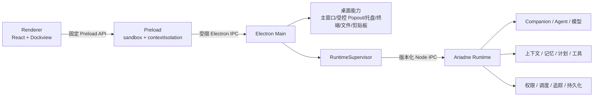
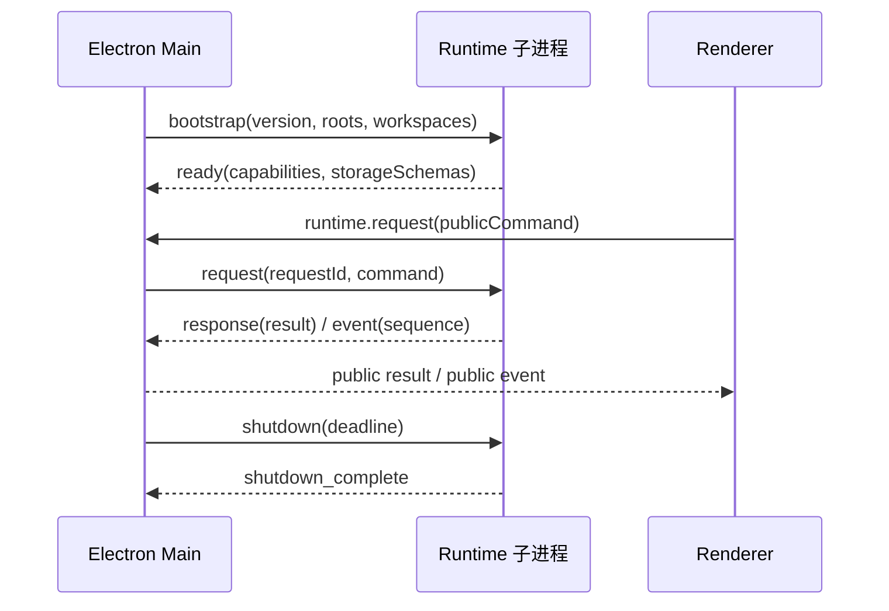

# Ariadne 架构设计

## 1. 设计目标

Ariadne 将桌面体验与 Agent 执行彻底分层：App 负责显示、输入、用户确认和桌面系统能力；Runtime 负责 Agent、模型、记忆、工具、任务和业务数据；Protocol 是两者唯一共享边界。

Ariadne Runtime 是本项目自有且唯一的 Agent 业务核心。Agent 循环、工具执行、计划、策略、上下文、记忆、调度、SubAgent、权限和沙箱逻辑均在当前仓库维护；构建、测试与发布不得读取其他源码项目。Electron Host 只负责进程生命周期、Node IPC/Public DTO、配置和桌面能力注入。独立性证据见 [Runtime 独立性审计](Runtime独立性审计.md)。

## 2. 组件职责

| 组件 | 负责 | 明确不负责 |
|---|---|---|
| 主 Renderer | UI、输入、状态投影、应用级审批弹窗、Dockview 布局 | Node、文件系统、子进程、数据库、模型调用、系统通知 |
| Preload | 暴露固定且类型化的桌面与 Runtime API | 通用 `ipcRenderer`、任意 channel、端口、路径和密钥 |
| Electron Main | 窗口/托盘/通知/终端/文件/剪贴板、Runtime 生命周期、协议转发 | Agent 编排、模型、记忆、工具业务逻辑 |
| Runtime | Companion、Agent、模型、上下文、记忆、计划、工具、权限、调度、持久化 | Electron UI 和桌面窗口 |
| Protocol | 严格 schema、版本、请求/响应/事件和公开 DTO | 业务实现和存储模型 |

## 3. 桌面窗口模型

- 默认仍是一个 Electron 主窗口，所有功能以 Dockview 面板注册；不会为每个模块预先创建原生窗口。
- 用户把模块标签拖出主窗口边界，或选择“在独立窗口中打开”时，Dockview 才按需创建原生 Popout。独立窗口继续复用原模块实例和类型化服务，不启动第二套 Agent/Runtime。
- Popout 内仍可停靠和拆分；关闭独立窗口时模块返回主工作区。弹出位置、尺寸和分组由 Dockview 布局 JSON 一并持久化，重启时按保存状态恢复。
- 打包版 Renderer 通过专用 Electron Session 将 `https://ariadne.local` 映射到本地只读构建资源，不启动 HTTP Server、不监听端口。该 Session 拒绝其他 `https` 主机。
- Main 的 `setWindowOpenHandler` 只允许同源且路径精确为 `/popout.html` 的窗口。Popout 是 `script-src 'none'` 的无脚本承载页，不装载 Preload、不属于 IPC 授权主体，也不直接接收 Runtime 事件；模块逻辑与类型化服务仍运行在唯一主 Renderer。子窗口保持 `sandbox`、`contextIsolation`、禁用 Node，并继续拒绝二次 `window.open` 与跨页导航。

主 Renderer 是受信任的本地 UI 主体，不是承载任意网页或插件的安全沙箱。当前 Renderer 不发起网络请求、不使用动态代码或原始 HTML 注入；模型 Markdown 禁用 HTML，并限制链接协议，导航仍由 Main 拦截。如果未来引入远程网页、第三方插件或不受信任脚本，必须放入独立且无 Preload 的 WebContents/View，不能复用主 Renderer 的终端、审批或 Runtime 命令能力。

## 4. 协议边界

协议分为 Public 与 Host 两层：

- Public 可经 Preload 进入 Renderer，只包含公开状态、命令结果、事件和资源引用。
- Host 只存在于 Main 与 Runtime，包含启动根目录、实例标识、请求 ID 和关闭控制。
- 所有入站消息均经严格 schema 校验；未知字段、错误版本、错误实例和非单调事件序号会被拒绝。
- 单条消息不超过 8 MiB；文件和图片不得以 Base64 穿过 IPC。该上限覆盖公开 2,000,000 字符消息契约，但仍在两个传输方向执行 fail-closed 尺寸检查。

## 5. 生命周期与故障隔离

- Main 是唯一 Runtime 进程所有者。
- 握手、普通请求和优雅关闭都有独立超时。
- Runtime 异常退出后按 250 ms、1 s、4 s 退避重启；连续失败后停用自动重启，只有持续就绪达到稳定窗口才清零失败计数。
- 所有未完成请求在退出或协议违规时统一拒绝，不留下悬挂 Promise。
- Runtime 收到优雅关闭请求后停止产生新事件、拒绝新请求，并在同一关闭截止时间内等待已接受请求完成；截止时间到达后才继续释放存储与进程资源。
- Runtime 状态和事件观察者彼此隔离；单个窗口或通知观察者抛错不会打断 Supervisor 消息处理，也不会阻止其他观察者接收事件。
- Ariadne 目标专用事件桥以 TraceIndex 启动边界和增量游标读取持久化事件，再按索引定位 segment；单次突发不受公开 `trace.list` 的 2,000 条查询上限影响。索引批次必须完整读取后才提交游标；segment 暂时不可用、轮转路径尚未同步或对应索引事件不可解析时本轮失败并保留原游标，待持久化状态恢复后重试，不能静默跳过事件。只有无索引兼容场景才回退到尾部窗口扫描。
- 长时间 Agent 执行不占用普通 IPC 请求超时：提案或审批先返回持久化状态，后续执行、恢复和终态通过 Runtime 事件发布。
- Main 只向 Renderer 发布稳定诊断，不转发原始 stderr、路径或内部异常对象。
- App 启动会等待 `loadURL` 真正完成；Renderer 载入失败进入顶层受控退出，不能以空白窗口伪装成启动成功。
- 打包态忽略并从 Runtime 子进程环境中移除开发用入口、Node、模型目录、profile 与默认工作区覆盖变量；已签名应用只能启动随包装配的 Runtime 与 Node runner。
- App 退出时先请求 Runtime flush/关闭并释放桌面资源，超时后才终止残余子进程；清理完成后由 Electron 正常关闭窗口和进程。
- 主窗口退出时关闭全部 Popout；单个 Popout 关闭只回停其 Dockview 分组，不触发应用退出或 Runtime 重启。

## 6. 数据与路径

- `installRoot`：Runtime 安装内容，只读。
- `dataRoot`：由 Electron `userData/runtime` 派生，Runtime 独占写入。
- `modelRoots`：显式配置的外部只读模型目录，默认空。
- `workspaces`：Main 从持久化 Agent 设置注入的稳定工作区根和读写级别；只读工作区不会公开写能力，也不能批准写入、删除、Shell 或危险操作。
- 文件浏览与终端创建都必须显式携带 `workspaceId`，Main 只从授权目录表解析真实根路径；同时校验词法路径与解析后的真实路径，直接构造指向工作区外部的符号链接或 Junction 路径会被拒绝。文件浏览器随当前导航工作区切换；已有终端不会被切换动作突然终止，新建或用户主动重启的终端绑定当时选中的工作区，并随主 Renderer 销毁或终端面板卸载而关闭。
- App 的桌面偏好、布局与 Runtime 的业务数据库分离。
- 桌面状态和 Agent 设置文件读取失败或格式损坏时 fail-closed；只有成功把损坏文件原样改名留档后才允许以默认值恢复，避免把唯一故障证据覆盖掉。
- 会改变系统状态的桌面偏好按顺序执行；如果持久化失败，Main 会补偿恢复上一份系统设置，补偿失败则同时报告原始错误和恢复错误。
- 模型与权限设置保存在 Electron `userData/settings.toml`；API Key 由 Main 使用系统安全存储加密，Preload 与 Renderer 不接收明文。旧 `agent-settings.json` 只在首次启动时迁移并改名留档，不再参与正常读写。
- Chat 权限菜单提供“请求批准 / 替我审批 / 完全访问权限 / 自定义”四档；前三档映射到固定的提案审批、Ariadne Run 权限与沙箱组合，自定义档读取 `settings.toml` 的 `customPermissions`。

## 7. Provider、Protocol 与模型能力

本地与远程模型共享 `ModelClient` 业务接口，但执行边界不同：本地模型由 Runtime 的 embedded runtime 直接启动，不经过 HTTP，也不依赖 Ollama、LM Studio、vLLM；远程模型才进入 Provider/Protocol adapter。

远程模型接入不把 OpenAI 当作内部业务依赖。Runtime 的远程 `ModelClient` 之下分为三类信息：

- Provider 标识厂商和独立凭据，例如 OpenAI、DeepSeek、Kimi、Anthropic。
- Protocol 只表示传输格式；多个厂商可复用 `openai-compatible`，也可接入原生 adapter。
- Model profile 声明指定模型支持的推理模式和强度；Provider adapter 负责映射厂商字段。

Chat 只发送通用的 `reasoningMode` 与 `reasoningEffort`。Runtime 根据当前模型 profile 再次校验，避免界面把不受支持的参数发给本地模型或远程 API。完整映射见 [Provider 协议与模型推理配置](Provider协议与模型推理配置.md)。

## 8. Renderer 状态流

Renderer 的 `RuntimeStore` 通过固定桥获取初始状态，并消费 Runtime 事件更新会话、消息、模型、提案、运行、活动、权限、计划和追踪记录。Runtime 事件桥会增量投影持久化的权限、计划和追踪变化；最终 Companion 消息也走同一公开事件边界。Renderer 不再生成 Mock 任务或伪造执行进度。

Public Run 显式标记 `origin=agent|companion`，Renderer 据此分别使用 `runs.cancel` 和 `companion.chat.cancel`。等待权限或计划时 Agent 已暂停，`runs.cancel` 会拒绝对应申请并复用同一终态收敛链路。审批 DTO 保留实际请求能力、风险、完整目标与允许作用域；Renderer 只能提交请求允许范围内的能力子集与 once/session/project/workspace 作用域，启动前校验失败仍同步返回错误，只有已进入 `executing` 的提案才切换为后台执行。

会话列表不是独立 Dockview 模块，而是 `chat.main` 内部的左侧导航栏。Chat 作为唯一注册模块统一拥有会话管理和消息工作区；布局版本升级时会丢弃仍包含旧 `conversations.list` 面板的持久化布局。

左侧导航按“工作区 → 会话”分层。Renderer 通过共享的 `ConversationNavigationService` 获取工作区目录、选择当前工作区、通知文件与终端模块，并保存纯导航元数据。顶部显式提供“打开工作区”和“新建会话”操作；打开工作区只能调用最小化 Preload API，由 Main 显示原生目录选择器、持久化新根目录并重启 Runtime，Renderer 不能提交任意文件系统路径。Runtime、Chat 和桌面能力统一使用 Main 授权的稳定 `workspaceId`；`workspaceRoot` 只作为 `primary` 的兼容投影，不再被文件或终端请求隐式采用。

会话的 `workspaceId` 属于公开 Runtime 会话契约，而不是 Renderer 推测值。新建会话优先沿用当前显示会话的工作区；没有当前会话时才使用左侧当前选中的工作区。Runtime 在 `ConversationWorkspaceRegistry` 中持久化 `sessionId → workspaceId`，创建时校验该工作区已由 Main 注入授权，后续 Chat 和 Agent 提案复用同一工作区，禁止会话创建后悄然切换。该 sidecar 与 Companion 领域存储分离。旧会话没有映射时使用 Runtime 默认工作区。

删除以 Companion 会话结果为业务权威。删除前先在 Agent 状态库的单一事务中拒绝待处理提案、撤销会话只读授权、移除 Agent 链接，并持久化包含精确恢复快照的删除意图；如果 Companion 的权威关系数据删除失败，则用 compare-and-swap 条件恢复上述访问状态，并在同一事务清除意图，恢复也失败时同时保留两个错误。若 Runtime 在两个存储提交之间退出，下次启动会读取删除意图：权威会话仍存在则恢复访问；会话已不存在则先完整重建对应向量索引，再确认 retire 并清除意图；存储或重建不可判定时保留意图和收紧后的访问状态。关系数据提交后，SQLite `DETACH` 或 LanceDB 向量项清理只作为提交后维护：失败会逐出旧连接、写入脱敏 Trace，并按需标记向量重建，但不会把已提交的会话删除伪报为失败或错误恢复 Agent 权限。

只有 Companion 业务删除成功后才清理 workspace sidecar。若 sidecar 落盘暂时失败，删除仍返回成功并写入脱敏 Trace 诊断；内存立即移除该明确 sessionId，后续任意一次成功 sidecar 写入会把无效磁盘映射一并清除。公开会话列表默认只返回最近 50 条，不能被误当成全量集合来推断孤儿映射。这样不会误删列表窗口之外仍存在会话的归属。

会话正文、标题和业务状态仍以 Runtime 为唯一权威，置顶覆盖与当前工作区选择仅保存为 Renderer 桌面偏好，不能提升文件或 Agent 权限。

工作区标题是可折叠的树节点：点击整行会选择该工作区并切换展开状态，收起后只保留工作区文件夹行。会话行只显示标题和必要的置顶标记，不常驻显示日期。详细更新时间、工作区和最近运行状态在鼠标悬停时通过自绘浮层展示。双击标题进入行内重命名，Enter 提交、Escape 取消；不再使用独立重命名按钮或弹窗。

Chat 发送时由 Renderer 生成 `clientMessageId`，先将用户消息以 pending 状态同步写入 `RuntimeStore`，再异步提交 Runtime。Runtime 持久化用户消息时沿用同一 ID；正式消息事件按 ID 原位替换 pending 消息，因此用户消息无需等待模型响应即可显示，也不会在新会话建立时重复或丢失。

新 Chat 的 `run_start` 可能先于 workspace sidecar 落盘。若新会话归属写入失败，Runtime 会先 abort 并有界等待流停止，再通过统一会话删除路径补偿清理刚创建的会话；补偿失败会同时报告原始错误和清理错误。请求原本指向已有会话时只停止本次运行，绝不能为了 sidecar 写入失败删除用户已有会话。

`CompanionConversationWorkflow` 在 `prepareTurn` 前接入外部 abort，并在知识检索完成后再次检查取消信号；新会话和首条消息只在该检查通过后持久化。因而在发布 `run_start` 前发生的启动超时不会创建 Host 不可见的会话或消息，也不需要 Host 推测或伪造会话身份。

界面正文、按钮、状态和空状态统一使用中文；`Agent`、`Runtime`、`API`、模型名称与快捷键等专业术语按行业习惯保留英文，并保证用词一致。

## 9. 发布边界

开发态可使用系统独立 Node 启动 Runtime。打包态必须随应用装配专用 Node runner、Runtime 构建产物和受信任的 Windows 沙箱 helper。安装包发布前还要验证安装器、主 EXE 和内嵌沙箱 helper 的签名、证书摘要、时间戳及 helper manifest 哈希，并验证模型与工具审批全链路、数据升级/回滚以及安装/卸载行为。
