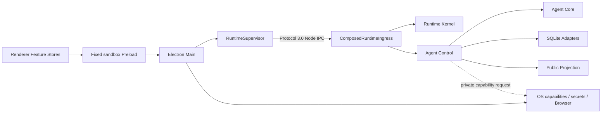

# Ariadne 当前实现架构

> 状态：Current implementation
> 核对日期：2026-08-26
> 本文描述当前生产接线；长期不变量见 [目标架构](architecture-v3.md)。

## 1. 进程与信任边界


```mermaid
flowchart LR
  R[Renderer Feature Stores] --> P[Fixed sandbox Preload]
  P --> M[Electron Main]
  M --> S[RuntimeSupervisor]
  S -->|Protocol 3.0 Node IPC| I[ComposedRuntimeIngress]
  I --> K[Runtime Kernel]
  I --> C[Agent Control]
  C --> A[Agent Core]
  C --> D[SQLite Adapters]
  C --> X[Public Projection]
  M --> O[OS capabilities / secrets / Browser]
  C -. private capability request .-> O
```

| 边界 | 负责 | 明确不负责 |
|---|---|---|
| Renderer | 展示、输入、桌面布局、消费 Public Projection | Node、数据库、密钥、绝对路径、Agent 领域推断 |
| Preload | 固定且类型化的最小 API | 通用 IPC、任意 channel、业务状态 |
| Electron Main | 窗口、文件、终端、Browser、安全存储、Runtime 生命周期 | Agent Run、Plan、Effect 和模型编排 |
| Runtime Kernel | Runtime 状态、模型目录与推理网关 | Conversation/Run 命令所有权 |
| Agent Control | Conversation、Run、Decision、Effect、投影和恢复 | Electron UI、明文凭据 |
| Agent Core | 领域状态机与应用 Port | Electron、Node、SQLite、具体 Provider/Tool |

Runtime 不启动入站 HTTP Server。远程 MCP HTTP/OAuth 和系统凭据由 Main 持有，Runtime 经私有 Host capability 使用；这些 Host DTO 不进入 Renderer。

## 2. 命令与协议

Host 与 Headless 协议当前均使用版本 `3.0`。所有入站消息执行严格 schema、版本、实例、尺寸、deadline 和 command identity 校验。

Public v3 命令面为：

| 所有者 | 命令 |
|---|---|
| Runtime Kernel | `runtime.status.get` |
| Agent Control | `projection.snapshot.get`、`projection.commits.read` |
| Conversation Authority | `conversation.session.create.v3`、`conversation.message.accept.v3` |
| Agent Control | `agent.decision.resolve.v3`、`agent.run.cancel.v3` |

任何未归属命令都返回 `runtime_command_not_supported`。Ingress 不会先尝试新 Control 再回退到旧实现。

## 3. 业务所有权与持久化

```text
dataRoot/data/
  runtime-control/runtime-command.db
  conversation/conversation.db
  agent-control/agent-control.db
  public-projection/projection.db
```

- Runtime Command Journal 只拥有 command identity、digest、执行确定性和有界 replay outcome。
- Conversation Store 是 Session、Message 和 Conversation-to-Agent Handoff 的唯一 Writer。
- Agent Control Store 是 Run、Turn、Inference Attempt、Decision、Effect、Plan、Budget、Delegation、Checkpoint、Receipt 和 Outbox 的唯一 Writer。
- Public Projection 是可重建读模型，只由 Conversation、Agent Run 和 Model publisher 更新。
- Trace、Renderer cache 和进程内队列都不能驱动恢复。

跨数据库流程使用持久 Saga/Inbox/Outbox，不做长期双写。外部 I/O 前先提交 intention/start；未知结果进入明确的 `uncertain` 或 recovery 状态。

## 4. Agent 执行链

```text
Message accepted
  -> Conversation Handoff outbox
  -> admission authority snapshot
  -> durable execution intent
  -> exact model inference
  -> respond | request decision | invoke tool
  -> authorized effect dispatch
  -> causal effect-result continuation
  -> terminal result projection
```

当前默认生产 Composition 已装配 `ProductionAgentControlExecutionPipelineFactory`、`AgentRunWorkScheduler`、精确模型网关和 immutable first-party Tool Catalog。Tool 身份、schema、输入摘要、工作区、能力授权和模型绑定在 admission 时固定；执行时不得按名称重新解析成另一实现。

Plan、Budget、Delegation 和 Child Run 已进入 Agent Core/Control 权威模型，但 SubAgent 从模型 Directive、Child Run 调度到公开投影和 UI 的完整产品闭环尚未接通。

## 5. Public Projection 与 Renderer

Renderer 冷启动读取 `projection.snapshot.get`，随后通过 `projection.commits.read` 按 cursor 拉取持久 commit。当前生产 publisher 覆盖：

- Conversation Session/Message；
- Agent Run/Decision/Activity；
- Model Catalog。

Diagnostics DTO 和 Store 虽然存在，但当前没有生产 Diagnostics publisher；日志面板不能被描述为完整、持久、可重放的 Runtime 日志产品。

Renderer 的写操作只使用 v3 Session/Message、Decision 和 Cancel 命令。它不再使用旧 `runtime.snapshot.get`、`events.replay`、Proposal/Permission/Plan 分散命令，也不从多个 legacy Store 修补领域状态。

## 6. 能力接线状态

| 分类 | 当前状态 |
|---|---|
| Conversation、Agent Run、Decision、Cancel、Projection | 已进入 v3 生产路径 |
| Workspace、first-party Tools、Browser、经授权 MCP | 已进入 Tool Catalog；真实端到端验收仍不完整 |
| Skills | 完整正文在 admission 时注入；尚未渐进披露 |
| Hooks | v3 只消费 `run.pre` |
| Context/Memory/Embedding | 有实现和测试，但没有完整 v3 生产 consumer |
| SubAgent/Background/Scheduler | 有领域或旧模块基础，没有 v3 产品闭环 |
| Diagnostics/Telemetry/Provider Resilience | 有 schema/实现片段，v3 生命周期或 consumer 不完整 |

Runtime status 只能宣告真实装配并满足权限条件的能力。协议枚举、设置字段、目录或单元测试本身都不是能力证据。

## 7. 生命周期与安全

- Main 是唯一 Runtime 进程所有者；握手、请求和关闭分别有界。
- Startup recovery 是 readiness 屏障；未完成恢复时不接受普通命令。
- Shutdown 先拒绝新命令、停止并 join producer/scheduler、排空投影，再冻结和释放 Store owner fence。
- Renderer 不接收密钥、PID、端口、绝对路径或内部异常对象。
- Workspace、文件与终端请求使用稳定 `workspaceId`；Main 解析真实根并校验 symlink/Junction 边界。
- API Key 由 Main 使用系统安全存储保护；Runtime 只收到受控环境槽位，Public DTO 不返回明文。
- Sandbox helper、打包 Runtime、模型资产和 Authenticode 使用 fail-closed 发布门禁。

## 8. 当前未验收

- 真实远程 Provider 与本地聊天模型；
- 签名 Sandbox helper 下的真实 MCP STDIO、远程 MCP OAuth 和 Browser 下载隔离；
- BGE-M3 或其他实际 Embedding 资产；
- 正式签名安装包的全新安装、N-1 升级、失败回滚、降级和卸载。

验证证据见 [验证说明](verification.md)，能力差距与路线见 [deepseek-harness 对比审计](deepseek-harness-comparison-audit-2026-08-26.md)。
