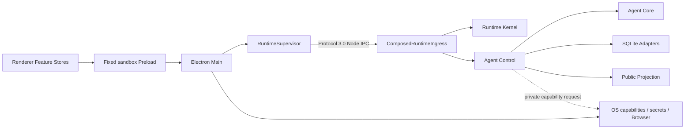

# Ariadne 当前实现架构

> 状态：Current implementation
> 核对日期：2026-08-26
> 本文描述当前生产接线；长期不变量见 [目标架构](architecture-v3.md)。

## 1. 进程与信任边界


```mermaid
flowchart LR
  R[Renderer Feature Stores] --> P[Fixed sandbox Preload]
  P --> M[Electron Main]
  M --> S[RuntimeSupervisor]
  S -->|Protocol 3.0 Node IPC| I[ComposedRuntimeIngress]
  I --> K[Runtime Kernel]
  I --> C[Agent Control]
  C --> A[Agent Core]
  C --> D[SQLite Adapters]
  C --> X[Public Projection]
  M --> O[OS capabilities / secrets / Browser]
  C -. private capability request .-> O
```

| 边界 | 负责 | 明确不负责 |
|---|---|---|
| Renderer | 展示、输入、桌面布局、消费 Public Projection | Node、数据库、密钥、绝对路径、Agent 领域推断 |
| Preload | 固定且类型化的最小 API | 通用 IPC、任意 channel、业务状态 |
| Electron Main | 窗口、文件、终端、Browser、安全存储、Runtime 生命周期 | Agent Run、Plan、Effect 和模型编排 |
| Runtime Kernel | Runtime 状态、模型目录与推理网关 | Conversation/Run 命令所有权 |
| Agent Control | Conversation、Run、Decision、Effect、投影和恢复 | Electron UI、明文凭据 |
| Agent Core | 领域状态机与应用 Port | Electron、Node、SQLite、具体 Provider/Tool |

Runtime 不启动入站 HTTP Server。远程 MCP HTTP/OAuth 和系统凭据由 Main 持有，Runtime 经私有 Host capability 使用；这些 Host DTO 不进入 Renderer。

## 2. 命令与协议

Host 与 Headless 协议当前均使用版本 `3.0`。所有入站消息执行严格 schema、版本、实例、尺寸、deadline 和 command identity 校验。

Public v3 命令面为：

| 所有者 | 命令 |
|---|---|
| Runtime Kernel | `runtime.status.get` |
| Agent Control | `projection.snapshot.get`、`projection.commits.read` |
| Conversation Authority | `conversation.session.create.v3`、`conversation.session.rename.v3`、`conversation.session.archive.v3`、`conversation.session.restore.v3`、`conversation.message.accept.v3` |
| Agent Control | `agent.decision.resolve.v3`、`agent.run.cancel.v3` |

任何未归属命令都返回 `runtime_command_not_supported`。Ingress 不会先尝试新 Control 再回退到旧实现。

## 3. 业务所有权与持久化

```text
dataRoot/data/
  runtime-control/runtime-command.db
  conversation/conversation.db
  agent-control/agent-control.db
  public-projection/projection.db
```

- Runtime Command Journal 只拥有 command identity、digest、执行确定性和有界 replay outcome。
- Conversation Store 是版本化 Session title/status、Message 和 Conversation-to-Agent Handoff 的唯一 Writer；精确 Session version 是不可变 replay source。
- Agent Control Store 是 Run、Turn、Inference Attempt、Decision、Effect、Plan、Budget、Delegation、Checkpoint、Receipt 和 Outbox 的唯一 Writer。
- Public Projection 是可重建读模型，只由 Conversation、Agent Run、Model、inference stream 和 observability publisher 更新。
- Trace、Renderer cache 和进程内队列都不能驱动恢复。

跨数据库流程使用持久 Saga/Inbox/Outbox，不做长期双写。外部 I/O 前先提交 intention/start；未知结果进入明确的 `uncertain` 或 recovery 状态。

## 4. Agent 执行链

```text
Message accepted
  -> Conversation Handoff outbox
  -> admission authority snapshot
  -> protected Conversation history through objective
  -> durable execution intent
  -> deterministic exact-capacity context preparation
  -> inference-start checkpoint with context request digests
  -> exact model inference + attempt-scoped public stream projection
  -> respond | request decision | invoke tool | delegate SubAgent
  -> authorized effect dispatch
  -> causal effect-result continuation
  -> or ordinary Child Run + child-result continuation
  -> terminal result projection
```

当前默认生产 Composition 在 bootstrap 时先编译静态 Capability Provider 图并冻结单一 Manifest，再由它向 Runtime Kernel 和 Agent Control 提供公开能力与 immutable first-party Tool Catalog。Provider 用 `dependsOn` 声明纯顺序、用 `consumes`/`provides` 声明实际 service 依赖；compiler 只把已声明且已启动的 service 注入 Provider scope。Workspace/Skill/mode instruction contributors 先组合为全有或全无的准入快照，再与 Telemetry、live-work 一起由终端 Provider 组装为类型化 Agent Control service bundle；默认 Factory 不再从 Manifest 按字符串查找扩展 service，也不再拼接系统提示。Tool 身份、schema、中立 model description/guidance、可公开静态 kind/label、输入摘要、工作区、能力授权和模型绑定在 admission 时固定；执行和投影时不得按名称重新解析成另一实现或展示映射，Tool input/result 仍留在受保护边界。

Plan、Budget、Delegation 和 Child Run 已进入 Agent Core/Control 权威模型。单个和批量 SubAgent Directive 都以一次事务提交 Parent 结果、预算、Delegation 与全部 Child；one-shot/continuable ordinary Child、持久 `waiting_input`、direct-parent send、interrupt、聚合结果回灌、父子/Provider 投影和 UI 状态已接通。Settings 可配置 ACP one-shot/resume、Codex app-server 与 Claude Code one-shot；外部 session ID 只进入加密的 provider-private store。

## 5. Public Projection 与 Renderer

Renderer 冷启动读取 `projection.snapshot.get`，随后通过 `projection.commits.read` 按 cursor 拉取持久 commit。当前生产 publisher 覆盖：

- Conversation Session/Message；
- Agent Run/Decision/Activity；
- Model Catalog；
- 精确 Run/Turn/Attempt 的 bounded token/reasoning stream。

Agent lifecycle diagnostics 由独立 observability publisher 脱敏后写入同一 Projection，支持 cursor/digest 重放、稳定 delivery 去重和 512 条 retention。它不是完整 Prompt/Tool 日志，也不拥有恢复权威。

Renderer 的写操作只使用 v3 Session lifecycle/Message、Decision、Cancel 和 Agent inbox 命令。Session title 与 archive/restore 只来自 Runtime Projection；本机导航存储仅保留 pin/unread。Renderer 不再使用旧 `runtime.snapshot.get`、`events.replay`、Proposal/Permission/Plan 分散命令，也不从多个 legacy Store 修补领域状态。

## 6. 能力接线状态

| 分类 | 当前状态 |
|---|---|
| Conversation、Agent Run、Decision、Cancel、Projection | 已进入 v3 生产路径 |
| Inference stream | exact Attempt 的 reasoning 与公开 `respond.content` 可持久重放；terminal Message 仍是唯一最终权威 |
| Workspace、first-party Tools、Browser、经授权 MCP | 已进入 Tool Catalog；真实端到端验收仍不完整 |
| Skills | 静态 Provider 按 Workspace 生成可取消 complete/incomplete snapshot；瞬时失败使用 last-good，权威缺失清除它；package revision 覆盖正文与有界资源，model/user policy 进入 invocation-neutral snapshot；正文与资源只经 admission-pinned `skill.load` / `skill.resource.read` 进入 protected continuation |
| Hooks | 8 个 typed lifecycle extension point 由 Manifest-owned 静态可信 Provider service 管理；pre 可拒绝、admission 只能收窄，post observer-only；handler set 与 Provider 按反向顺序关闭 |
| Context | Conversation 历史、确定性 semantic compaction、protected Effect result spill、usage anchor、逐 binding tokenizer、最终投影硬准入和 overflow recovery 已进入 v3；真实本地 llama.cpp 跨进程长上下文验收已通过，远程 Live Provider 仍待有 credential 的环境执行 |
| Memory/Embedding | 有旧实现和测试，但没有完整 v3 生产 consumer |
| SubAgent | 单个/批量 Child、one-shot/continuable ordinary Run、list/status/send/interrupt、ACP resume、Codex app-server 与 Claude Code one-shot 已接入；structured report、真实窗口与 Claude live credential gate 待验收 |
| Scheduler | 有旧 cron/interval/file/git 模块基础，没有 v3 产品闭环；旧 Background process/trigger contract 已删除 |
| Diagnostics/Telemetry | lifecycle diagnostics 已持久、脱敏、可重放；Telemetry 只在 exporter 启动成功后宣告 |
| Provider Resilience | 冻结 policy 已进入 exact v3 transport；按 Provider/model/settings 隔离并发、速率、首语义输出前重试和熔断，429/5xx/timeout 与有界 Retry-After 有确定性测试 |

Runtime status 只读取 bootstrap 冻结 Manifest 中已成功启动 Provider 的输出，不再自行读取配置拼接清单。协议枚举但没有 Provider owner 的条目进入 `unwiredPublicCapabilities` 审计结果，不能出现在 status。详见 [Runtime Capability Manifest](capability-manifest.md)。

## 7. 生命周期与安全

- Main 是唯一 Runtime 进程所有者；握手、请求和关闭分别有界。
- Runtime pipe process、沙箱内 Agent PTY 与 Main PTY producer 共用 `@ariadne/live-work`：registry 统一 owner、生命周期、UTF-8 输出游标、有限保留、互斥输入、resize/signal/wait、完成通知和 cancel/join；OS handle 仍由各 backend 持有且不伪装为可跨重启恢复。
- Agent 通过 `process_start/terminal_start` 创建 producer，通过 `job_list/job_output/job_write/job_resize/job_signal/job_wait/job_kill` 使用唯一控制面。Agent PTY worker 运行在原 Sandbox lease/Windows Job 中；Terminal 的 Preload 事件携带同一 live-work snapshot/chunk。
- Agent live-work 完成由专用 bridge 转成 `source.kind=live_work` 的系统 inbox 输入；只有 UoW 提交成功后才唤醒 work scheduler 与 Public Projection。关机 barrier 在 Store freeze 前 close/join live work 并排空 completion sink。
- Agent 主动提问由 `ask_user` Directive 进入 Agent Control：受保护问题载荷、`waiting/user_question` Decision、公开脱敏展示、回答 action 和 `user_question_answer` inbox receipt 构成同一持久链路；Renderer 不持有等待 Promise，也不能绕过 Decision token 直接恢复 Run。
- Runtime 启动恢复不依赖已丢失的 registry：它在 scheduler 启动前扫描活跃 Run 的受保护成功 `workspace.process_start`/`workspace.terminal_start` Effect 结果，把仍声明 `running` 且没有终态 inbox 事实的 Job 幂等收敛为 `interrupted`。旧 handle/output 不会被伪装为可恢复资源。
- Main Terminal 的原子元数据 journal 同样不保存命令或输出；Main 强杀后的旧 `running` 会在下一进程启动时收敛为 `interrupted/main_process_lost`。Renderer 公开恢复提示与显式 restart，新的 session 记录 `restartOf`，禁止自动重放。
- Startup recovery 是 readiness 屏障；未完成恢复时不接受普通命令。
- Shutdown 先拒绝新命令、停止并 join producer/scheduler、排空投影，再冻结和释放 Store owner fence。
- Renderer 不接收密钥、PID、端口、绝对路径或内部异常对象。
- Workspace、文件与终端请求使用稳定 `workspaceId`；Main 解析真实根并校验 symlink/Junction 边界。
- API Key 由 Main 使用系统安全存储保护；Runtime 只收到受控环境槽位，Public DTO 不返回明文。
- Sandbox helper、打包 Runtime、模型资产和 Authenticode 使用 fail-closed 发布门禁。

## 8. 当前未验收

- 真实远程 Provider 与本地聊天模型；
- 签名 Sandbox helper 下的真实 MCP STDIO、远程 MCP OAuth 和 Browser 下载隔离；
- BGE-M3 或其他实际 Embedding 资产；
- 正式签名安装包的全新安装、N-1 升级、失败回滚、降级和卸载。

验证证据见 [验证说明](verification.md)，能力差距与路线见 [deepseek-harness 对比审计](deepseek-harness-comparison-audit-2026-08-28.md)。
