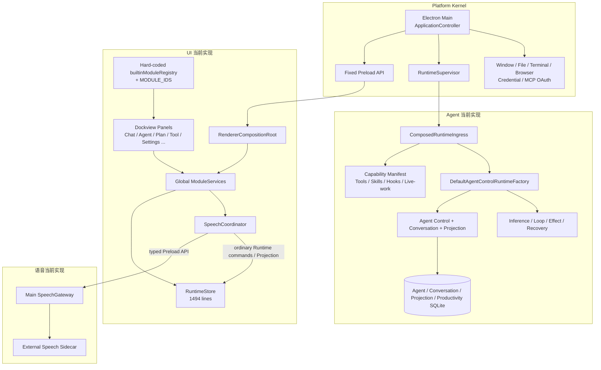
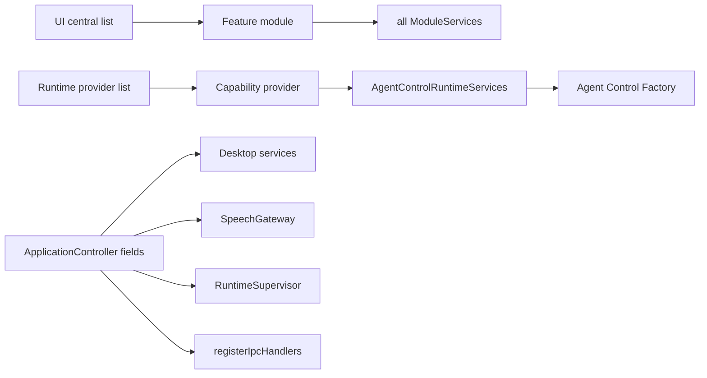
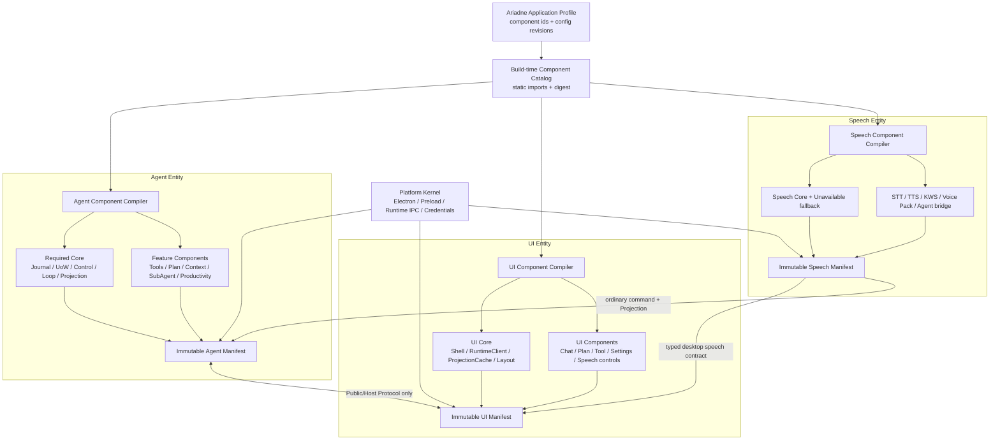
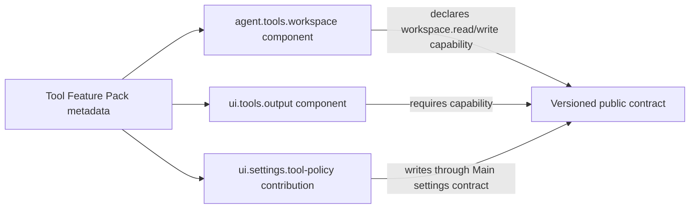
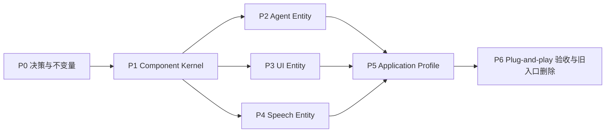

# Ariadne 实体组件化架构评估与实施路线

> 状态：Proposed architecture roadmap
> 核对日期：2026-08-31
> 评估基线：Git `2fed953`
> 适用范围：当前 Ariadne monorepo
> 本文性质：架构评估与实施计划，不授权直接修改生产代码

## 1. 结论

方案**可行、有意义，建议实施**，但不应照搬游戏中的数据驱动 ECS，也不应把当前可靠的领域 Owner、SQLite 事务、恢复协议替换成通用组件容器。

建议采用 **Entity–Component Assembly（ECA，实体组件装配）**：

- Agent、UI、语音是三个产品实体；
- 每个实体由一组静态、强类型、可审计的组件组成；
- 组件声明依赖、输出、能力、生命周期和验收契约；
- 构建期生成不可变 Catalog，启动时编译依赖图并 fail closed；
- 三个实体只通过版本化协议和公开 capability 相互协作；
- Electron Main、Preload、Runtime transport、Credential 和进程生命周期继续属于 **Platform Kernel**，它是三个产品实体的安全承载层，不是第四个可选产品实体；
- 第一阶段的“即插即用”是**源码/构建期即插即用**：增加一个组件目录和描述文件即可被 Catalog 收录，不支持从任意磁盘目录执行未审计代码，也不支持运行中热插拔。

该方案比当前架构更好的范围是**组合与扩展局部性**，不是重写 Agent 领域模型。当前的单一 Owner、Agent UoW、Conversation Authority、Public Projection、Sandbox、Credential seam 和强杀恢复必须保留。

如果目标被改成以下任一项，则应终止本计划：

- 用通用 ECS Store 替代 Agent/Conversation/Productivity 的事务权威；
- 允许 Renderer 或用户目录向 Runtime 动态注入 JavaScript；
- 允许组件绕过 Public/Host Protocol 直接跨进程拿对象；
- 为了“组件独立”给每个小功能新建数据库、Run 状态机或事件总线；
- 要求生产运行中任意卸载 Loop、Persistence、Command Journal 等核心组件。

## 2. 为什么现在值得做

当前项目已经具备组件化的三个重要基础，但它们还没有形成统一装配模型。

### 2.1 已有基础

| 区域 | 已有机制 | 可复用价值 |
|---|---|---|
| Runtime | `RuntimeCapabilityProvider`、`dependsOn`、`consumes`、`provides`、反向关闭 | 已经是 Agent 组件图的雏形 |
| Tool | immutable Tool Catalog、固定 schema/digest、Provider contribution | 适合直接成为 Tool Family 组件贡献 |
| UI | `FeatureModuleDefinition`、`ModuleRegistry`、Dockview、模块生命周期和 Error Boundary | 已经是 UI Panel 组件模型 |
| Speech | Main `SpeechGateway`、Renderer `SpeechCoordinator`、外部 Sidecar 协议 | 已具备可替换、进程隔离的边界 |
| 架构治理 | 0 SCC 架构门禁、热点上限、可复现检查、真实 Electron 验收 | 可以防止组件容器退化为 Service Locator |

### 2.2 当前扩展仍然分散

2026-08-31 快照中的主要组合热点：

| 文件 | 行数 | 当前问题 |
|---|---:|---|
| `app/src/renderer/src/core/runtime/runtime-store.ts` | 1,494 | 传输、Projection cache、多个 feature command/query API 仍集中 |
| `runtime/src/agent/AgentLoop.ts` | 917 | Loop 仍承载多类执行协调，尚未成为清晰的必选核心组件 |
| `runtime/src/composition/DefaultAgentControlRuntimeFactory.ts` | 819 | Store、Publisher、Router、Worker 与生命周期仍由一个 Factory 大量实例化 |
| `runtime/src/composition/AgentControlPublicCommandRouter.ts` | 737 | 新 command owner 仍需修改集中 Router |
| `app/src/main/application.ts` | 540 | Main 服务、Speech、Runtime、Window、IPC 都由类字段硬编码装配 |
| `app/src/main/ipc/register-ipc.ts` | 413 | 不同桌面能力共享一个注册入口和依赖对象 |
| `app/src/renderer/src/core/speech/speech-coordinator.ts` | 396 | STT、TTS、Agent bridge、偏好和流式朗读策略集中 |

最近加入 Productivity/Scheduler 纵向能力时，单个变更触及 Protocol、Runtime Store、Router、Factory、Capability Provider、Renderer Registry、Module ID、UI、测试与文档等 46 个文件。这不是这些改动本身错误，而是说明“新增能力”尚未收敛为一个局部组件包。

### 2.3 当前 UI 是模块化，但还不是完整组件化

当前 UI 的 Panel 注册已经模块化，但存在四个缺口：

1. `builtinModuleRegistry` 和 `MODULE_IDS` 是人工维护的中央清单；
2. Activity Bar、默认布局、Settings 特殊弹窗仍按具体模块 ID 硬编码；
3. 所有模块收到完整 `ModuleServices`，不是按声明注入的最小 service scope；
4. 所有 `requiredCapabilities` 当前均为空，Registry 没有真正执行 Runtime capability gate。

因此，当前模型解决了“面板可停靠”，尚未解决“功能包可追加”。

### 2.4 当前 Agent 已有组件图，但覆盖不完整

Runtime Capability Manifest 已经正确处理 Tool、Skills、Hooks、Telemetry、live-work 和 instruction assembly 等扩展能力。但下列核心仍在 Manifest 之外由 Factory/Router 硬装配：

- Agent Control persistence；
- Conversation handoff；
- Public Projection publisher；
- Inference/Loop pipeline；
- command/query handler owner；
- Productivity/Schedule worker；
- Model/Context/Policy 的终端组合。

目标不是再建第二个 Agent 插件系统，而是把现有 Manifest 提升为 Agent Entity 的唯一装配边界。

### 2.5 语音是独立能力，但尚未形成实体

Speech 当前横跨三个位置：

- Electron Main：`SpeechGateway` 持有 Sidecar 进程与协议；
- Renderer：`SpeechCoordinator` 连接偏好、Composer、Agent inbox 与流式 TTS；
- 外部模块：Speech Sidecar 执行 STT/TTS/KWS/Voice Pack。

边界是正确的，但 Main 和 Renderer 都直接 `new`/持有语音实现，STT、TTS、KWS、Voice Pack、Agent bridge 无法独立替换或关闭。语音适合成为组件化收益最大的可选实体。

## 3. 不能直接使用游戏 ECS 的原因

游戏 ECS 通常强调：Entity 只有 ID，Component 主要是数据，System 按帧查询组件集合并执行行为。Ariadne 的核心问题不同：

- Agent 外部 I/O 必须先提交 intention/start，不能由 System 扫描到组件后直接执行；
- Run、Decision、Effect、Budget 与恢复需要一个事务 Owner，不能拆成多份可写 Component Store；
- UI、Runtime、Main、Speech Sidecar 处于不同进程和信任域，不能共享同一个 World；
- Tool、模型、Credential 和 Sandbox 需要 capability 收窄，不是“有某个组件就能访问”；
- 生命周期包含启动回滚、shutdown barrier、强杀恢复和 schema migration，不是简单 add/remove component。

因此只借用 ECS 的两个思想：

1. 一个实体由一组声明式组件组合；
2. 新能力优先通过新增组件而不是修改实体核心。

不借用共享 World、运行时任意增删、逐帧 System 扫描和分散可写状态。

## 4. 当前项目架构图



### 4.1 当前真实组合关系



这里已经不存在严重循环依赖，但新增能力仍要修改多个中央装配点。

## 5. 目标概念模型

### 5.1 Product Entity 与 Platform Kernel

| 名称 | 角色 | 是否可整体禁用 |
|---|---|---|
| Platform Kernel | Electron/Preload/Runtime transport、安全存储、进程与协议边界 | 否 |
| Agent Entity | 对话、推理 Loop、Tool、Plan、Context、SubAgent、恢复 | 否；部分 feature 可选 |
| UI Entity | Shell、Panel、Navigation、Settings page、Projection feature store | 否；Panel 可选 |
| Speech Entity | STT、TTS、KWS、Voice Pack、Agent bridge | 是，必须有 unavailable fallback |
| Ariadne Application Profile | 选择三个实体的组件集合并校验跨实体契约 | 否 |

“三个实体最终组合成项目”应实现为 Application Profile 编译三个独立 Manifest，而不是把三个实体实例放进一个可枚举的全局容器。

### 5.2 组件契约

所有实体共享最小的描述模型，但每种实体有自己的合法 contribution：

```ts
type EntityKind = 'agent' | 'ui' | 'speech';

interface ComponentDescriptor<THandle> {
  readonly id: string;
  readonly version: string;
  readonly entity: EntityKind;
  readonly required: boolean;
  readonly dependsOn: readonly ComponentId[];
  readonly consumes: readonly ServiceRequirement[];
  readonly provides: readonly ServiceProvision[];
  readonly configSchemaVersion: number;
  start(scope: DeclaredServiceScope): Promise<THandle> | THandle;
}

interface ComponentHandle {
  health(): ComponentHealth;
  prepareShutdown?(context: ShutdownContext): Promise<void> | void;
  close?(context: ShutdownContext): Promise<void> | void;
}
```

实际实现必须使用带泛型的 `serviceToken<T>()`，字符串 ID 只用于序列化、诊断和 digest。组件不能枚举全局 service map，也不能读取未声明依赖。

### 5.3 不同实体的贡献类型

#### AgentComponent

允许贡献：

- Public capability；
- command/query handler ownership；
- Tool registration；
- Directive/Effect handler；
- Projection publisher；
- recovery participant；
- background worker；
- component-owned schema declaration和显式离线 migration；
- typed service port。

不允许：

- 直接写另一个组件的表；
- 在 UoW 事务中调用外部 I/O；
- 创建第二个 Run/Conversation authority；
- 通过 component ID 在运行时重新解析 admission-pinned Tool；
- 绕过 command receipt 或 Public Projection。

#### UiComponent

允许贡献：

- Dockview Panel；
- Navigation action/group；
- Command Palette action；
- Settings section/page；
- Projection feature store；
- 只读 badge/status presenter；
- module lifecycle。

每项 UI contribution 必须声明需要的 Runtime capability 和最小 UI service token。缺少 capability 时不注册操作入口，并显示“未安装/未启用”而不是 Mock。

#### SpeechComponent

允许贡献：

- STT/TTS/KWS driver；
- Voice Pack provider；
- device catalog；
- Main gateway method；
- Renderer composer/Agent bridge；
- Speech settings contribution；
- unavailable fallback。

语音组件不得直接写 Agent Store；语音文本继续走普通 Conversation/Inbox command，Agent 输出继续来自 Public Projection。

### 5.4 核心组件与可选组件

“组件化”不表示所有组件都能卸载。

| 实体 | 必选核心 | 可选 Feature |
|---|---|---|
| Agent | Command Journal、Persistence Owner、Conversation Authority、Control、Projection、Inference Loop、Shutdown/Recovery | Tool families、Plan UI contract、SubAgent、Skills、Hooks、Productivity、Telemetry、Browser、MCP |
| UI | Renderer Shell、Runtime Client、Projection Cache、Layout、Error Boundary | Chat、Plan、Tool Output、Files、Terminal、Settings pages、Logs、Productivity |
| Speech | Speech entity shell、Unavailable adapter | STT、TTS、KWS、Voice Pack、background wake、Agent bridge |

Loop 可以成为组件，但它是 Agent Entity 的 required core component。Tool、Plan、Context 等通过 Port 和 contribution registry 接入 Loop，不得把 Loop 变成一个动态查表执行任意函数的插件宿主。

## 6. 目标架构图



### 6.1 Feature Pack 与实体组件的关系

一个用户可见功能可以由多个实体组件配对，但它们不能互相导入实现：



Feature Pack 只关联 component ID、版本和验收矩阵，不传递运行时对象。

## 7. 目标目录结构

第一阶段不大规模搬迁业务文件，先建立新边界。稳定后再按实体归档：

```text
packages/
  component-contracts/
    src/
      descriptor.ts
      service-token.ts
      graph.ts
      manifest.ts
      diagnostics.ts

profiles/
  desktop-default.profile.ts
  desktop-no-speech.profile.ts

runtime/src/composition/agent-entity/
  AgentEntityCompiler.ts
  components/
    kernel/
    persistence/
    conversation/
    inference-loop/
    tools-workspace/
    tools-browser/
    plan-decision/
    subagent/
    productivity/
    skills-hooks/
    observability/

app/src/renderer/src/entity/ui/
  UiEntityCompiler.ts
  components/
    shell/
    chat/
    agent-status/
    plan/
    tool-output/
    productivity/
    files/
    terminal/
    settings-shell/

app/src/main/speech/entity/
  SpeechEntityCompiler.ts
  components/
    core/
    stt/
    tts/
    kws/
    voice-pack/
    agent-bridge/

scripts/components/
  discover-components.mjs
  verify-component-catalog.mjs
```

构建脚本只扫描仓库内固定根目录和固定文件名，生成临时静态 import catalog 与 digest。Catalog 不执行用户目录代码，不依赖文件系统遍历顺序，输入路径、ID 和版本全部 canonicalize 后排序。

## 8. 从当前实现到目标实现的映射

| 当前实现 | 目标位置 | 迁移原则 |
|---|---|---|
| `RuntimeCapabilityProvider` | `AgentComponentDescriptor` 的基础 | 扩展而不是另起容器 |
| `ProductionRuntimeCapabilityProviders` | build-generated Agent Catalog + profile | 删除人工数组 |
| `DefaultAgentControlRuntimeFactory` | 多个 required Agent component handle | 每次抽一个 owner，立即降低门禁 |
| `AgentControlPublicCommandRouter` | compiler 验证的 command owner table | command kind 只能有一个 owner |
| Tool registration factories | Tool component contributions | 保留 immutable catalog/digest |
| `FeatureModuleDefinition` | `UiComponentDescriptor.panel` | 保留 Dockview adapter 和 Error Boundary |
| `builtinModuleRegistry` / `MODULE_IDS` | build-generated UI Catalog | 删除中央 ID 清单 |
| `ActivityBar` 静态 actions | navigation contributions | 排序、分组和快捷键由 descriptor 声明 |
| `ModuleServices` | declared UI service scope | 模块只能拿到所需服务 |
| `RuntimeStore` | RuntimeClient + ProjectionCache + Feature Stores | cursor 应用保持单一、feature API 分开 |
| Settings 特殊分支 | Settings shell + page contributions | Settings authority 仍在 Main |
| `ApplicationController` 字段装配 | Platform composition handles | 不把 Main 变成通用 Service Locator |
| `SpeechGateway` | Speech Main core/driver components | Sidecar 崩溃隔离不变 |
| `SpeechCoordinator` | Speech UI bridge + Agent bridge components | STT/TTS/Agent bridge 分开 |

## 9. 实施路线图



### P0：冻结决策与边界

产物：

- 新 ADR：采用 ECA，不采用共享 World ECS；
- 核心/可选组件清单；
- 跨实体只能使用 Protocol 的规则；
- component ID、version、service token、profile revision 规范；
- “源码/构建期即插即用”和“外部插件”明确分开。

验收：

- Architecture Gate 增加禁止第二个 service locator、禁止跨实体实现导入的规则；
- 现有测试全部不变通过；
- 本阶段不搬业务代码。

### P1：建立 Component Kernel

实现：

- 新建无 Node/Electron/React 依赖的 `@ariadne/component-contracts`；
- 从当前 Runtime Manifest compiler 提取通用的图校验、原子 publication、反向关闭和诊断模型；
- 建立强类型 `serviceToken<T>()` 和 declared-only scope；
- 建立 build-time Catalog discovery、canonical 排序和 digest；
- Profile 显式区分 required、enabled、disabled component；
- 增加 duplicate owner、missing dependency、cycle、undeclared access、partial start rollback 测试。

验收：

- Component Kernel 不依赖 Runtime/App；
- 同一输入在 Windows/CI 生成相同 Catalog digest；
- 禁止任意目录扫描和运行时动态 import；
- 未通过图校验时不得打开业务 Store 或创建窗口。

### P2：把 Agent 扩展图升级为 Agent Entity

迁移顺序：

1. 直接适配现有 Tool/Skills/Hooks/Telemetry Provider；
2. 把 Model/Context/Policy 终端 bundle 变成 required components；
3. 抽出 Persistence Owner component，统一创建 Agent/Conversation/Projection/Productivity Store；
4. 抽出 Conversation/Handoff component；
5. 抽出 Projection component；
6. 把 Inference Loop/Effect/Recovery 作为 required execution component；
7. 把 Plan/Decision/Budget、SubAgent、Productivity/Schedule 变成 feature components；
8. Router 改为由 compiler 生成静态 command/query owner table；
9. `DefaultAgentControlRuntimeFactory` 最终只接收 `AgentEntityManifest` 并返回一个 `AgentEntityHandle`。

关键约束：

- Persistence component 可以提供多个 typed repository port，但 Agent 事务仍只有一个 owner；
- Plan、Tool、SubAgent 组件贡献 handler，不各自创建 Agent Loop；
- command/query ownership、projection ownership 和 storage schema ownership不可重复；
- offline migration 在启动前显式执行，组件 `start()` 不自动改 schema；
- 每完成一次抽取就删除 Factory/Router 中的旧分支并下调热点门禁。

验收：

- 新增一个测试 Tool family 只增加组件目录，不修改 Agent central list；
- 禁用 Browser/MCP/SubAgent 后 Agent core 仍启动，status 精确反映能力；
- 禁用 required Loop/Persistence 时 profile 编译失败；
- Runtime 强杀恢复、command replay、Tool/Inference uncertain 行为不变；
- Factory 与 Router 不再随 feature 数量线性增长。

### P3：把 UI Panel Registry 升级为 UI Entity

迁移顺序：

1. `FeatureModuleDefinition` 扩展为 UI component contribution；
2. 启用并强制执行 `requiredCapabilities`；
3. 把 Panel、Navigation、Command Palette、Settings page、badge 统一收进 descriptor；
4. 用 build-generated UI Catalog 替代 `builtinModuleRegistry` 与 `MODULE_IDS`；
5. 删除 Activity Bar、默认布局和 Settings 的具体 ID 特判；
6. 把 `ModuleServices` 改为 declared-only UI service scope；
7. 把 `RuntimeStore` 拆为单一 RuntimeClient/ProjectionCache 与 Session、Message、Run、Decision、Model、Productivity、Diagnostics Feature Store；
8. Panel 只消费自己的 Feature Store，不互相写状态。

验收：

- 新增一个 Panel 组件不修改 App、ActivityBar、ModuleMenu、ID 列表或测试计数；
- 缺少 Runtime capability 时操作入口不会出现，布局恢复不会创建幽灵 Panel；
- 一个 Panel 渲染/初始化失败只触发自己的 Error Boundary；
- Popout 继续共享主 Renderer entity，不新建 Runtime connection；
- Snapshot + cursor 仍由唯一 ProjectionCache 原子应用。

### P4：建立可移除的 Speech Entity

迁移顺序：

1. 定义 Speech core、driver 和 bridge Port；
2. 把 Sidecar lifecycle 从具体 `SpeechGateway` 提取为 required speech core；
3. STT、TTS、KWS、Voice Pack 分别成为可选 driver components；
4. Renderer Composer bridge 与 Agent inbox/TTS bridge 分开；
5. Speech settings 通过 UI settings contribution 注册；
6. `desktop-no-speech` profile 使用 `UnavailableSpeechAdapter`，不注册驱动与 UI 操作；
7. 从 `ApplicationController` 和全局 `ModuleServices` 删除对具体 Speech 实现的直接构造。

验收：

- 删除/禁用 Speech entity 后文字聊天、Agent Run、Tool、Settings 其余部分全部可用；
- Sidecar 崩溃只把 Speech health 置为 unavailable，不重启 Runtime、不清空会话；
- 可只替换 TTS 或 STT；
- Speech 文本仍通过普通 v3 command，禁止直接调用 Agent 内部对象；
- 真实窗口分别验证 no-speech、STT-only、TTS-only 和完整 profile。

### P5：建立 Application Profile 与跨实体校验

实现：

- `desktop-default`、`desktop-no-speech` 等 profile；
- 为每个实体编译独立 Manifest 和 digest；
- Application assembly 只接收三个 entity handle 与 Platform Kernel ports；
- 跨实体要求用 capability/contract version 校验，例如 UI Tool Output 依赖 Agent Tool Activity Projection；
- status/diagnostics 输出 component id/version/health，不输出密钥、路径或 payload；
- 配置更新区分需要实体重启、只需组件重配和完全无需重启。

验收：

- Profile 缺少跨实体依赖时在 readiness 前失败；
- UI 不导入 Runtime/Speech 实现，Speech 不导入 Agent Store；
- profile digest 进入诊断和验收工件；
- 组件按依赖逆序关闭，任何部分启动失败都回滚已启动组件。

### P6：即插即用验收与旧入口删除

使用两个样板能力证明目标真正成立：

1. 纯 UI 组件：一个只读 Runtime health Panel；
2. 纵向组件包：一个受保护的只读 Agent Tool + 对应 UI detail Panel + Settings page。

加入它们时只允许：

- 新建组件目录；
- 新建组件描述与实现；
- 新建组件自己的测试；
- 在 profile 配置中启用组件（默认 profile 需要启用时）。

不允许修改：

- Agent Factory/Router；
- Renderer App/ActivityBar/ModuleMenu；
- 手写 ID 或 Provider 中央数组；
- Main 巨型 IPC switch；
- 其他组件源码。

完成后删除：

- `builtinModuleRegistry` 手写列表；
- `MODULE_IDS` 中央表；
- `ProductionRuntimeCapabilityProviders` 手写数组；
- Factory/Router 中按 feature 增长的装配分支；
- `ApplicationController` 对具体 Speech 实现的直接构造；
- 不再有生产引用的旧 AgentLoop/Orchestrator 路径。

## 10. 风险与控制措施

| 风险 | 可能后果 | 控制措施 |
|---|---|---|
| 组件过细 | 调用图和启动图比现状更复杂 | 以 owner/lifecycle/optional deployment 为拆分条件，不以文件为组件 |
| 通用 Service Locator | 隐式依赖、运行时类型错误 | typed token + declared-only scope + architecture gate |
| 动态插件扩大攻击面 | 任意代码、密钥与文件访问 | 第一阶段只接受仓库内静态组件和构建期 Catalog |
| 每组件独立 Store | 跨库补偿和恢复爆炸 | persistence owner 统一，组件只拿 repository port |
| UI/backend 同包直接导入 | 破坏信任边界 | Feature Pack 只关联 ID；实体实现只通过 Protocol 交互 |
| 组件版本漂移 | Projection/配置/数据无法读取 | contract version、profile revision、catalog digest、显式 migration |
| 生命周期不完整 | 资源泄漏、关机卡死 | start rollback、prepareShutdown、reverse close、deadline 测试 |
| capability 只写不执行 | UI 显示幽灵能力 | 编译器校验 owner，UI Registry 强制 capability gate |
| 一次性大迁移 | 恢复链断裂 | 垂直切片替换，双路并存只限测试窗口，切换后立即删除旧路 |
| “即插即用”被理解为热插拔 | 核心组件运行中卸载造成不确定状态 | 明确 bootstrap-frozen；热插拔另立安全设计，不在本路线内 |

## 11. 每个组件的完成定义

组件只有同时满足以下条件才算完成：

1. 有稳定 ID、version、entity kind、owner 和配置 schema；
2. 所有 dependency/service/capability 均显式声明；
3. 启动、健康、shutdown、失败回滚有测试；
4. command/query/projection/tool/storage owner 不重复；
5. 没有跨实体实现 import；
6. 没有明文 secret、绝对路径、内部异常进入 Public DTO；
7. 关闭组件后不存在幽灵 UI、Capability、Tool 或后台 Worker；
8. 数据升级有显式离线 migration 和回滚说明；
9. 组件自己的单元/集成测试和所属实体验收通过；
10. 新增该组件不要求修改无关组件或中央路由列表。

## 12. 项目级最终验收

- 三个 Entity Manifest 与一个 Application Profile 均不可变且有稳定 digest；
- Component graph 无环、无重复 owner、无未声明依赖；
- Agent Factory/Router、Renderer App/RuntimeStore、Main Application/IPC 不再随 feature 数量线性增长；
- 新增样板纵向能力只增加组件目录、测试与 profile 配置；
- `desktop-no-speech` 可完整运行文字 Agent；
- Tool、Plan、Settings 等组件有配对 UI contribution，但 UI 与 Agent 只共享协议；
- Runtime/Renderer/Speech 任一可选组件失败时，故障被限制在所属实体；
- Runtime 强杀、Main 强杀、Sidecar 崩溃、Panel render error 均收敛到既有明确状态；
- 全仓 typecheck、测试、Architecture Gate、Runtime independence、source reproducibility 和真实 Electron profile matrix 全部通过；
- 外部插件/热加载在没有签名、权限、迁移和隔离设计前继续 fail closed。

## 13. 推荐的第一批改动

若批准实施，不应先移动目录或重写 Agent Loop。第一批只做：

1. 新增 ECA ADR；
2. 建立 `@ariadne/component-contracts` 和 compiler tests；
3. 用适配器让现有 `RuntimeCapabilityProvider` 在新 Agent Catalog 下运行；
4. 用现有 UI modules 生成只读 UI Catalog，但暂不改变 Panel 行为；
5. 增加 `desktop-default`/`desktop-no-speech` profile 与 digest；
6. 选择一个低风险只读组件验证“只加目录、不改中央列表”；
7. 通过后才开始拆 Factory、RuntimeStore 和 SpeechCoordinator。

这条顺序可以先证明新抽象真的减少扩展修改面，再允许它接管生产生命周期，避免为了组件化而制造第二套长期并存的框架。
