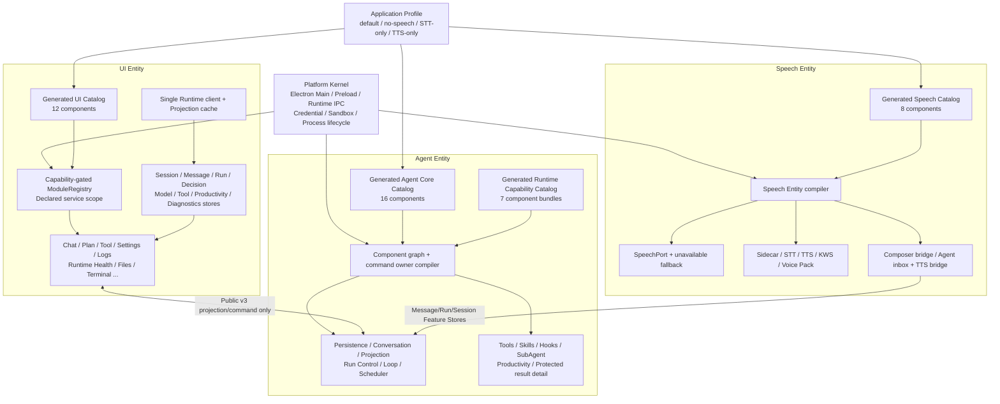
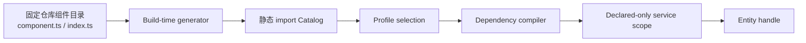
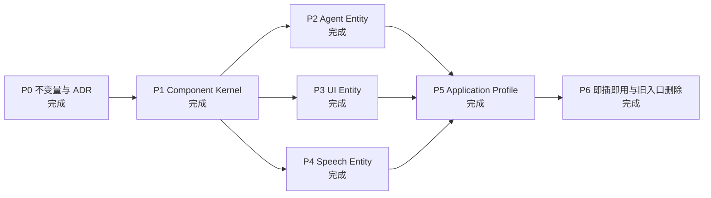

# Ariadne 实体组件架构与实施路线

> 状态：Implemented baseline
> 更新日期：2026-08-31
> 当前分支：`main`
> 架构形式：Entity–Component Assembly（ECA），不是共享 World 的游戏 ECS

## 1. 结论

该方案可行且有实际收益，已经实施为 Ariadne 的生产装配基线。

Ariadne 现在由三个产品实体组成：

- Agent Entity：Conversation、Persistence、Projection、Loop、Tool、Plan、SubAgent、Scheduler 等组件；
- UI Entity：Shell、Dockview Panel、Feature Store、Navigation、Settings、Error Boundary 等组件；
- Speech Entity：Core、Sidecar、STT、TTS、KWS、Voice Pack、Renderer bridge、Agent bridge 等组件。

三个实体由一个不可变 Application Profile 选择和组合，Electron Main、Preload、Runtime transport、Credential、Sandbox 与进程监管仍属于不可卸载的 Platform Kernel。

这里采用 ECS 的“实体由组件组合”思想，但不采用共享 World、逐帧扫描或分散可写 Store。Agent Run、Conversation、Projection 和事务恢复仍由唯一领域 Owner 管理。

## 2. 当前架构图



## 3. 组件发现与启动关系



关键约束：

- 只扫描仓库内固定目录，不执行用户目录代码；
- Catalog 排序稳定，`--check` 会阻止陈旧生成文件进入构建；
- missing dependency、duplicate owner、cycle、unknown component、undeclared service access 全部 fail closed；
- 组件启动失败时回滚已启动组件，关闭时按依赖逆序执行；
- Renderer 与 Runtime/Speech 实现不共享对象，只使用 Preload API 和 Public Protocol；
- 核心组件 bootstrap-frozen，不支持生产运行中任意热卸载。

## 4. 三个实体的当前边界

### 4.1 Agent Entity

Agent Core Catalog 位于：

```text
runtime/src/composition/agent-entity/components/*/component.ts
```

Runtime capability Catalog 位于：

```text
runtime/src/composition/runtime-capabilities/components/*/component.ts
```

当前结果：

- Agent core、Persistence、Conversation、Projection、Inference Loop、Tool execution、SubAgent、Scheduler 等均有组件定义；
- command owner table 由组件 contribution 编译，不再使用巨型 command switch；
- `DefaultAgentControlRuntimeFactory` 只负责终端组合，不再随 feature 数量线性增长；
- 原人工 `ProductionRuntimeCapabilityProviders` 数组已删除；
- `workspace.effect_result_read` 已成为独立 `protected-result-detail` capability 组件，同时复用受保护结果协议和 Tool detail UI。

Agent Profile 当前使用 `*`，表示启用构建内所有受审计 Agent core/capability 组件。具体 Tool、MCP、Skills、Browser 等可用性仍由 Runtime policy、权限与 admission authority 收窄，而不是允许 Profile 绕过安全策略。

### 4.2 UI Entity

UI 组件位于：

```text
app/src/renderer/src/modules/*/index.ts
```

当前结果：

- 中央 `MODULE_IDS` 与手写 builtin module list 已删除；
- Panel、Navigation、默认布局、Error Boundary 和声明式 service scope 由 descriptor 驱动；
- Panel 不再消费巨型 Runtime snapshot，而是消费自己的 Feature Store；
- Runtime connection 与 Projection cursor/cache 仍保持唯一；
- 默认布局按 `referenceModuleId` 拓扑装配，不依赖目录或 Catalog 的偶然顺序；
- `runtime.health` 是纯 UI 即插即用样板，只新增组件目录并在 Profile 启用。

### 4.3 Speech Entity

Speech descriptor 位于：

```text
app/src/main/speech/entity/components/*/component.ts
```

当前结果：

- `ApplicationController` 不再直接构造 `SpeechGateway`；
- IPC 只依赖 `SpeechPort`；
- 无驱动时使用不创建子进程的 `UnavailableSpeechAdapter`；
- capability adapter 对 STT、TTS、KWS、Voice Pack 独立 fail closed；
- Renderer `SpeechCoordinator` 只负责前台录音、偏好和 Composer；
- `SpeechAgentBridge` 只通过 Message/Run/Session Feature Store 路由文本和观察输出；
- no-speech Profile 不构造 Agent speech bridge，也不显示麦克风或语音设置入口；
- Sidecar 崩溃仍被限制在 Speech Entity，不会重启 Runtime 或清空会话。

## 5. Application Profile

生产 Profile：

| Profile | Speech 组合 | UI 行为 |
|---|---|---|
| `desktop-default` | Core + Sidecar + STT + TTS + KWS + Voice Pack + bridges | 麦克风与语音设置可见 |
| `desktop-no-speech` | Core + unavailable fallback | 无麦克风、无语音设置分类，文字 Agent 保持可用 |
| `desktop-stt-only` | Core + Sidecar + STT + bridges | 只有语音输入入口 |
| `desktop-tts-only` | Core + Sidecar + TTS + Voice Pack + bridges | 无麦克风，保留语音输出设置 |

每个 Profile 具有：

- profile ID 与 revision；
- Agent、UI、Speech 三份组件选择；
- 三个实体各自的稳定 SHA-256 digest；
- 一个项目级稳定 SHA-256 digest；
- Renderer 日志中的可见 Profile 标识。

Profile 在创建窗口前编译；未知 Profile、缺少实体、重复组件、非法 ID、缺少 Speech core 或 bridge 依赖不完整都会在 readiness 前失败。

## 6. 实施路线状态



| 阶段 | 主要结果 | 验收状态 |
|---|---|---|
| P0 | ECA 边界、禁止共享 World/service locator、跨实体协议规则 | 完成 |
| P1 | `@ariadne/component-contracts`、typed token、graph、catalog、rollback lifecycle | 完成 |
| P2 | Agent core components、command owners、Factory/Router 拆分、生成 Catalog | 完成 |
| P3 | 生成 UI Catalog、declared scope、Feature Stores、布局拓扑装配 | 完成 |
| P4 | SpeechPort、compiler、unavailable fallback、STT/TTS 分离、Agent bridge | 完成 |
| P5 | 四个 Profile、跨实体校验、实体 digest、Main/Renderer 同源选择 | 完成 |
| P6 | Runtime Health 样板、Protected Result 纵向样板、旧中央入口删除、窗口矩阵 | 完成 |

## 7. 后续追加组件的标准流程

### 新增 Agent core component

1. 新建 `runtime/src/composition/agent-entity/components/<name>/component.ts`；
2. 在组件目录内实现 owner/handle 和测试；
3. 运行 `npm run generate:agent-components`；
4. 不修改 Factory、Router 或手写 provider list。

### 新增 Runtime capability / Tool family

1. 新建 `runtime/src/composition/runtime-capabilities/components/<name>/component.ts`；
2. descriptor 声明依赖、capability、service 和 Tool contribution；
3. 运行 `npm run generate:runtime-capabilities`；
4. 若改变第一方 immutable Tool contract，必须显式升级 Tool Catalog revision/digest 与 admission contract。

### 新增 UI component

1. 新建 `app/src/renderer/src/modules/<name>/index.ts` 与组件实现；
2. descriptor 声明 `consumes`、capability gate、navigation 和 placement；
3. 运行 `npm run generate:ui-components`；
4. 仅在需要默认启用时修改 Profile；不修改 App、ActivityBar、ModuleMenu 或 ID 表。

### 新增 Speech component

1. 新建 `app/src/main/speech/entity/components/<name>/component.ts`；
2. 声明 Speech 依赖图并实现对应 `SpeechPort` contribution/adapter；
3. 运行 `npm run generate:speech-components`；
4. 仅在相应 Profile 启用该组件。

## 8. 必须保留的安全与事务不变量

- Agent/Conversation/Productivity 的写入权威不能拆成多个竞争 Store；
- Tool 外部 I/O 继续遵循 intention/start/settlement 与 uncertain recovery；
- credential 不进入 Renderer、Profile、diagnostics 或 component digest；
- UI capability 缺失时隐藏操作入口，不注册 Mock；
- Speech 文本必须走普通 Conversation/Inbox command；
- Catalog 不允许运行时加载任意磁盘 JavaScript；
- 外部插件、签名、权限、迁移和隔离在形成独立安全设计前继续 fail closed。

## 9. 验收命令与证据

```text
npm run typecheck
npm test
npm run check:architecture
npm run verify:source-snapshot
npm run test:electron-profiles
```

2026-08-31 的 Profile 窗口矩阵已验证：

- `desktop-default`：通过；
- `desktop-no-speech`：通过；
- `desktop-stt-only`：通过；
- `desktop-tts-only`：通过。

验收产物位于 `artifacts/electron-profile-matrix/<profile>/profile-window.json` 与 `profile-window.png`。这些产物用于本地证据，不作为源码提交。

## 10. 不属于本轮“组件化基线”的后续优化

以下工作仍有价值，但不是继续建立第二套组件框架：

- 将 393 行的 Sidecar driver 继续按 transport、request broker、voice-pack driver 拆分；
- 继续按事务 owner 拆分两个大型 SQLite UoW；
- 将 Settings 内的贡献进一步细分为独立 settings page/section descriptor；
- 为 Agent Profile 增加显式的可选 feature selection，而 core 继续 required；
- 为外部插件另行设计签名、权限、隔离、migration 与升级回滚协议。

这些优化应继续遵循本文件的 ECA 边界，不应恢复中央 switch、全局 service locator 或跨实体实现导入。
